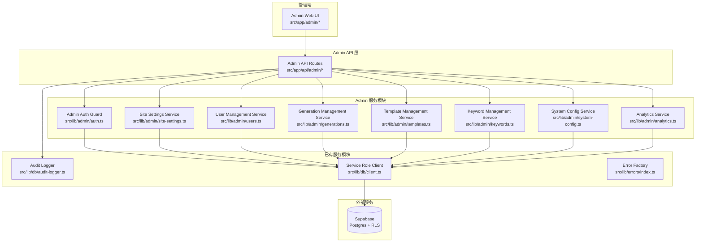

# 设计文档：后台管理系统（Admin Panel）

## 1. 概述

### 目标

为 AutoContent Pro 构建后台管理系统，使管理员能够通过 Web 界面管理站点内容、用户、生成记录、平台模板、审核关键词、系统配置，并查看审计日志和运营数据。

### 依赖前置阶段

| 阶段 | 提供的能力 |
|------|-----------|
| Phase 1 `autocontent-pro-mvp` | 核心生成流程、平台模板、内容审核 |
| Phase 2 `supabase-infrastructure` | 数据库 schema、RLS、`audit_logs` |
| Phase 3 `cloud-data-plan-foundation` | 生成记录、使用统计、历史 API |
| Phase 4 `payments-monetization` | 订阅计划、Lemon Squeezy |
| Phase 5 `risk-control-launch-readiness` | 限流、审计日志、内容审核增强 |
| Phase 6 `v2-product-differentiation` | 自定义模板、批量处理、团队、API Key |

### 范围说明

仅覆盖后台管理系统的数据库迁移、API 路由、服务层模块和前端页面。不修改现有用户端功能逻辑，仅在必要处增加数据库读取回退（如站点设置、系统模板、屏蔽关键词）。

---

## 2. 系统架构



---

## 3. 数据库设计

### 3.1 profiles 表变更

在现有 `profiles` 表上新增两个字段：

```sql
ALTER TABLE public.profiles
  ADD COLUMN IF NOT EXISTS role VARCHAR(20) NOT NULL DEFAULT 'user'
    CHECK (role IN ('user', 'admin', 'super_admin')),
  ADD COLUMN IF NOT EXISTS is_disabled BOOLEAN NOT NULL DEFAULT FALSE;
```

### 3.2 新增表：`site_settings`

```sql
CREATE TABLE IF NOT EXISTS public.site_settings (
  key         VARCHAR(100) PRIMARY KEY,
  value       TEXT         NOT NULL,
  value_type  VARCHAR(20)  NOT NULL DEFAULT 'string'
              CHECK (value_type IN ('string', 'integer', 'boolean', 'json')),
  updated_by  UUID         REFERENCES auth.users(id) ON DELETE SET NULL,
  updated_at  TIMESTAMPTZ  NOT NULL DEFAULT now()
);
```

预置键值：

| key | value_type | 默认值 | 说明 |
|-----|-----------|--------|------|
| `site_title` | string | `AutoContent Pro` | 站点标题 |
| `site_description` | string | `粘贴视频脚本，一键生成 10 大平台专属文案` | 站点描述 |
| `hero_title` | string | `AutoContent Pro` | Hero 区域标题 |
| `hero_description` | string | （当前 Hero.tsx 中的描述文本） | Hero 区域描述 |
| `copyright_text` | string | `© 2026 AutoContent Pro` | 页脚版权 |
| `meta_keywords` | string | `AI文案,多平台文案,内容创作` | SEO 关键词 |
| `system:rate_limit_per_minute` | integer | `20` | 每分钟速率限制 |
| `system:max_input_length` | integer | `100000` | 最大输入字符数 |
| `system:max_platforms_per_request` | integer | `10` | 单次最大平台数 |

### 3.3 新增表：`system_templates`

```sql
CREATE TABLE IF NOT EXISTS public.system_templates (
  platform           VARCHAR(30)  PRIMARY KEY,
  display_name       VARCHAR(100) NOT NULL,
  prompt_instructions TEXT        NOT NULL,
  max_title_length   INTEGER      NOT NULL CHECK (max_title_length >= 0),
  max_content_length INTEGER      NOT NULL CHECK (max_content_length >= 0),
  hashtag_style      VARCHAR(20)  NOT NULL
                     CHECK (hashtag_style IN ('inline', 'trailing', 'none')),
  prompt_version     VARCHAR(50)  NOT NULL DEFAULT 'v1',
  updated_by         UUID         REFERENCES auth.users(id) ON DELETE SET NULL,
  updated_at         TIMESTAMPTZ  NOT NULL DEFAULT now()
);
```

Migration 中使用 `INSERT ... ON CONFLICT DO NOTHING` 从 `PLATFORM_TEMPLATES` 常量种子数据。

### 3.4 新增表：`blocked_keywords`

```sql
CREATE TABLE IF NOT EXISTS public.blocked_keywords (
  id         UUID         PRIMARY KEY DEFAULT gen_random_uuid(),
  keyword    VARCHAR(100) NOT NULL UNIQUE,
  category   VARCHAR(50)  NOT NULL DEFAULT 'general',
  created_by UUID         REFERENCES auth.users(id) ON DELETE SET NULL,
  created_at TIMESTAMPTZ  NOT NULL DEFAULT now()
);

CREATE INDEX IF NOT EXISTS idx_blocked_keywords_category
  ON public.blocked_keywords(category);
```

Migration 中从 `BLOCKED_KEYWORDS` 常量种子数据。

### 3.5 RLS 策略

| 表 | 策略 | 说明 |
|----|------|------|
| `site_settings` | RLS 启用，无 permissive 策略 | 仅 service role 可读写 |
| `system_templates` | RLS 启用，SELECT: `true`（所有认证用户可读） | 写操作通过 service role |
| `blocked_keywords` | RLS 启用，无 permissive 策略 | 仅 service role 可读写 |

所有 Admin API 路由使用 `createServiceRoleClient()` 绕过 RLS。

### 3.6 Migration 文件

路径：`supabase/migrations/20260318000000_admin_panel.sql`

包含：profiles 字段变更、site_settings 表、system_templates 表、blocked_keywords 表、种子数据、RLS 策略。

---

## 4. API 接口设计

所有 Admin API 路由位于 `src/app/api/admin/` 下，遵循统一响应格式 `ApiSuccess<T>` / `ApiError`。

所有路由入口调用 `requireAdmin()` 鉴权守卫，失败返回 401/403。

### 4.1 鉴权守卫

```typescript
// src/lib/admin/auth.ts
export async function requireAdmin(): Promise<{
  id: string;
  email: string;
  role: 'admin' | 'super_admin';
}>
```

流程：
1. 调用 `getSession()` 获取当前用户
2. 使用 service role client 查询 `profiles` 表获取 `role` 和 `is_disabled`
3. 若 `is_disabled === true`，返回 `ACCOUNT_DISABLED` 错误
4. 若 `role` 不是 `admin` 或 `super_admin`，返回 `FORBIDDEN` 错误
5. 返回 `{ id, email, role }`

### 4.2 站点设置接口

#### `GET /api/admin/settings`

获取所有站点设置（不含 `system:` 前缀的键）。

- 认证：Admin
- 响应：`ApiSuccess<SiteSetting[]>`

```typescript
interface SiteSetting {
  key: string;
  value: string;
  valueType: 'string' | 'integer' | 'boolean' | 'json';
  updatedBy: string | null;
  updatedAt: string;
}
```

#### `PUT /api/admin/settings`

批量更新站点设置。

- 认证：Admin
- 请求体：

```typescript
{
  settings: Array<{ key: string; value: string }>;
}
```

- Zod 校验：每个 value 非空且 ≤ 2000 字符
- 响应：`ApiSuccess<SiteSetting[]>`
- 审计：每个变更键记录 `SITE_SETTING_UPDATED`

### 4.3 用户管理接口

#### `GET /api/admin/users`

分页用户列表。

- 认证：Admin
- 查询参数：`page`, `pageSize`(默认 20), `search`, `role`, `plan`, `status`
- 响应：`ApiSuccess<{ items: AdminUserItem[]; total: number; page: number; pageSize: number }>`

```typescript
interface AdminUserItem {
  id: string;
  email: string;
  displayName: string | null;
  role: 'user' | 'admin' | 'super_admin';
  planCode: string | null;
  generationCount: number;
  isDisabled: boolean;
  createdAt: string;
}
```

#### `GET /api/admin/users/[id]`

用户详情。

- 认证：Admin
- 响应：`ApiSuccess<AdminUserDetail>`

```typescript
interface AdminUserDetail extends AdminUserItem {
  subscription: {
    planCode: string;
    planName: string;
    status: string;
    currentPeriodEnd: string | null;
  } | null;
  usageStats: {
    currentMonth: string;
    monthlyCount: number;
    totalCount: number;
  } | null;
  recentGenerations: Array<{
    id: string;
    platforms: string[];
    status: string;
    createdAt: string;
  }>;
}
```

#### `PATCH /api/admin/users/[id]`

更新用户状态或角色。

- 认证：Admin（角色变更需 super_admin）
- 请求体：

```typescript
{
  isDisabled?: boolean;
  role?: 'user' | 'admin' | 'super_admin';
}
```

- Zod 校验：至少提供一个字段
- 审计：`USER_DISABLED` / `USER_ENABLED` / `USER_ROLE_CHANGED`
- 错误码：`INSUFFICIENT_PERMISSIONS`（非 super_admin 改角色）

#### `PATCH /api/admin/users/[id]/subscription`

管理员修改用户订阅计划。

- 认证：Admin
- 请求体：`{ planCode: string }`
- 审计：`SUBSCRIPTION_ADMIN_CHANGED`（含 old/new plan code）

### 4.4 生成记录管理接口

#### `GET /api/admin/generations`

分页生成记录列表。

- 认证：Admin
- 查询参数：`page`, `pageSize`(默认 20), `userId`, `platform`, `status`, `startDate`, `endDate`, `search`, `sortBy`(`created_at`|`duration_ms`|`tokens_input`), `sortOrder`(`asc`|`desc`)
- 响应：`ApiSuccess<{ items: AdminGenerationItem[]; total: number; page: number; pageSize: number }>`

```typescript
interface AdminGenerationItem {
  id: string;
  userEmail: string | null;
  inputSnippet: string;
  platforms: string[];
  status: string;
  modelName: string | null;
  durationMs: number;
  tokensInput: number;
  tokensOutput: number;
  createdAt: string;
}
```

#### `GET /api/admin/generations/[id]`

生成记录详情。

- 认证：Admin
- 响应：`ApiSuccess<AdminGenerationDetail>`（含完整 inputContent、resultJson、用户信息）

### 4.5 系统模板管理接口

#### `GET /api/admin/templates`

获取所有系统平台模板。

- 认证：Admin
- 响应：`ApiSuccess<SystemTemplate[]>`

```typescript
interface SystemTemplate {
  platform: string;
  displayName: string;
  promptInstructions: string;
  maxTitleLength: number;
  maxContentLength: number;
  hashtagStyle: 'inline' | 'trailing' | 'none';
  promptVersion: string;
  updatedBy: string | null;
  updatedAt: string;
}
```

#### `PUT /api/admin/templates/[platform]`

更新指定平台模板。

- 认证：Admin
- 请求体：

```typescript
{
  displayName?: string;
  promptInstructions?: string;
  maxTitleLength?: number;
  maxContentLength?: number;
  hashtagStyle?: 'inline' | 'trailing' | 'none';
  promptVersion?: string;
}
```

- Zod 校验：maxTitleLength/maxContentLength ≥ 0，promptInstructions 非空
- 审计：`TEMPLATE_UPDATED`

### 4.6 审计日志接口

#### `GET /api/admin/audit-logs`

分页审计日志列表。

- 认证：Admin
- 查询参数：`page`, `pageSize`(默认 50), `action`, `userId`, `resourceType`, `startDate`, `endDate`
- 响应：`ApiSuccess<{ items: AuditLogItem[]; total: number; page: number; pageSize: number }>`

```typescript
interface AuditLogItem {
  id: string;
  userEmail: string | null;
  action: string;
  resourceType: string | null;
  resourceId: string | null;
  ipAddress: string | null;
  metadata: Record<string, unknown>;
  createdAt: string;
}
```

### 4.7 关键词管理接口

#### `GET /api/admin/keywords`

分页关键词列表。

- 认证：Admin
- 查询参数：`page`, `pageSize`(默认 50), `category`
- 响应：`ApiSuccess<{ items: BlockedKeywordItem[]; total: number; page: number; pageSize: number }>`

```typescript
interface BlockedKeywordItem {
  id: string;
  keyword: string;
  category: string;
  createdBy: string | null;
  createdAt: string;
}
```

#### `POST /api/admin/keywords`

添加关键词。

- 认证：Admin
- 请求体：`{ keyword: string; category?: string }`
- Zod 校验：keyword 非空且 ≤ 100 字符
- 审计：`KEYWORD_ADDED`
- 错误码：`INVALID_INPUT`（重复关键词）

#### `DELETE /api/admin/keywords/[id]`

删除关键词。

- 认证：Admin
- 审计：`KEYWORD_REMOVED`

### 4.8 系统配置接口

#### `GET /api/admin/system-config`

获取所有 `system:` 前缀的配置项。

- 认证：Admin
- 响应：`ApiSuccess<SystemConfigItem[]>`

```typescript
interface SystemConfigItem {
  key: string;        // 不含 system: 前缀
  value: string;
  valueType: string;
  updatedBy: string | null;
  updatedAt: string;
}
```

#### `PUT /api/admin/system-config`

批量更新系统配置。

- 认证：Admin
- 请求体：`{ configs: Array<{ key: string; value: string }> }`
- Zod 校验：根据 valueType 校验值（integer 必须为有效数字，boolean 必须为 `true`/`false`）
- 审计：`SYSTEM_CONFIG_UPDATED`（含 old/new value）

### 4.9 运营数据接口

#### `GET /api/admin/analytics/summary`

概览数据卡片。

- 认证：Admin
- 响应：`ApiSuccess<AnalyticsSummary>`

```typescript
interface AnalyticsSummary {
  totalUsers: number;
  todayActiveUsers: number;
  totalGenerations: number;
  todayGenerations: number;
}
```

#### `GET /api/admin/analytics/trends`

生成趋势（过去 30 天）。

- 认证：Admin
- 响应：`ApiSuccess<DailyTrend[]>`

```typescript
interface DailyTrend {
  date: string;   // YYYY-MM-DD
  count: number;
}
```

#### `GET /api/admin/analytics/platforms`

平台分布（过去 30 天）。

- 认证：Admin
- 响应：`ApiSuccess<PlatformDistribution[]>`

```typescript
interface PlatformDistribution {
  platform: string;
  count: number;
  percentage: number;
}
```

#### `GET /api/admin/analytics/top-users`

本月 Top 10 用户。

- 认证：Admin
- 响应：`ApiSuccess<TopUser[]>`

```typescript
interface TopUser {
  userId: string;
  email: string;
  generationCount: number;
  planCode: string | null;
}
```

#### `GET /api/admin/analytics/subscriptions`

订阅分布。

- 认证：Admin
- 响应：`ApiSuccess<SubscriptionDistribution[]>`

```typescript
interface SubscriptionDistribution {
  planCode: string;
  planName: string;
  count: number;
}
```

---

## 5. 模块设计

### 5.1 `src/lib/admin/auth.ts` — 管理员鉴权守卫

```typescript
export async function requireAdmin(): Promise<{
  id: string;
  email: string;
  role: 'admin' | 'super_admin';
}>;

export async function requireSuperAdmin(): Promise<{
  id: string;
  email: string;
  role: 'super_admin';
}>;
```

实现细节：
- 调用 `getSession()` 获取当前用户 session
- 使用 `createServiceRoleClient()` 查询 `profiles` 表的 `role` 和 `is_disabled` 字段
- 失败时抛出包含 error code 的异常，由路由层捕获并返回 `ApiError`

### 5.2 `src/lib/admin/site-settings.ts` — 站点设置服务

```typescript
export async function getAllSiteSettings(): Promise<SiteSetting[]>;
export async function updateSiteSettings(
  settings: Array<{ key: string; value: string }>,
  adminId: string
): Promise<SiteSetting[]>;
export async function getSiteSetting(key: string): Promise<string | null>;
export async function getSiteSettingWithDefault(key: string, defaultValue: string): Promise<string>;
```

实现细节：
- `getSiteSettingWithDefault` 供前端 Server Component 使用，读取数据库值并回退到硬编码默认值
- 所有写操作通过 service role client
- 更新时先读取旧值，写入审计日志后再更新

### 5.3 `src/lib/admin/users.ts` — 用户管理服务

```typescript
export async function listUsers(params: ListUsersParams): Promise<PaginatedResult<AdminUserItem>>;
export async function getUserDetail(userId: string): Promise<AdminUserDetail>;
export async function updateUserStatus(userId: string, isDisabled: boolean, adminId: string): Promise<void>;
export async function updateUserRole(userId: string, role: string, adminId: string): Promise<void>;
export async function updateUserSubscription(userId: string, planCode: string, adminId: string): Promise<void>;
```

实现细节：
- `listUsers` 使用 service role client 联合查询 `auth.users`（通过 Supabase Admin API `listUsers`）、`profiles`、`current_active_subscriptions` 视图、`usage_stats`
- 搜索使用 `ilike` 模糊匹配 email 和 display_name
- 角色变更前校验当前管理员是否为 super_admin

### 5.4 `src/lib/admin/generations.ts` — 生成记录管理服务

```typescript
export async function listGenerations(params: ListGenerationsParams): Promise<PaginatedResult<AdminGenerationItem>>;
export async function getGenerationDetail(id: string): Promise<AdminGenerationDetail>;
```

实现细节：
- 使用 service role client 查询 `generations` 表，联合 `auth.users` 获取 email
- 支持 `input_content ilike '%keyword%'` 全文搜索
- 支持多字段排序
- 平台筛选使用 `platforms @> ARRAY['douyin']` 数组包含查询

### 5.5 `src/lib/admin/templates.ts` — 系统模板管理服务

```typescript
export async function listSystemTemplates(): Promise<SystemTemplate[]>;
export async function updateSystemTemplate(
  platform: string,
  data: Partial<SystemTemplateInput>,
  adminId: string
): Promise<SystemTemplate>;
export async function getSystemTemplate(platform: string): Promise<PlatformTemplate>;
```

实现细节：
- `getSystemTemplate` 供 AI 生成服务使用，先查数据库，无记录则回退到 `PLATFORM_TEMPLATES` 常量
- 更新时记录变更字段到审计日志 metadata

### 5.6 `src/lib/admin/keywords.ts` — 关键词管理服务

```typescript
export async function listKeywords(params: ListKeywordsParams): Promise<PaginatedResult<BlockedKeywordItem>>;
export async function addKeyword(keyword: string, category: string, adminId: string): Promise<BlockedKeywordItem>;
export async function removeKeyword(id: string, adminId: string): Promise<void>;
export async function getAllBlockedKeywords(): Promise<string[]>;
```

实现细节：
- `getAllBlockedKeywords` 供内容审核服务使用，先查数据库，表为空则回退到 `BLOCKED_KEYWORDS` 常量
- 添加时检查唯一性约束，捕获 duplicate key 错误返回 `INVALID_INPUT`

### 5.7 `src/lib/admin/system-config.ts` — 系统配置服务

```typescript
export async function listSystemConfigs(): Promise<SystemConfigItem[]>;
export async function updateSystemConfigs(
  configs: Array<{ key: string; value: string }>,
  adminId: string
): Promise<SystemConfigItem[]>;
export async function getSystemConfig(key: string, defaultValue: string): Promise<string>;
export async function getSystemConfigInt(key: string, defaultValue: number): Promise<number>;
```

实现细节：
- 复用 `site_settings` 表，key 使用 `system:` 前缀
- `getSystemConfig` / `getSystemConfigInt` 供业务模块使用（如速率限制），回退到默认值
- 更新时根据 `value_type` 校验值格式

### 5.8 `src/lib/admin/analytics.ts` — 运营数据服务

```typescript
export async function getSummary(): Promise<AnalyticsSummary>;
export async function getGenerationTrends(days: number): Promise<DailyTrend[]>;
export async function getPlatformDistribution(days: number): Promise<PlatformDistribution[]>;
export async function getTopUsers(limit: number): Promise<TopUser[]>;
export async function getSubscriptionDistribution(): Promise<SubscriptionDistribution[]>;
```

实现细节：
- 所有查询使用 service role client
- `getSummary` 使用 `COUNT(*)` 聚合查询
- `getGenerationTrends` 使用 `DATE_TRUNC('day', created_at)` 分组
- `getPlatformDistribution` 使用 `UNNEST(platforms)` 展开数组后分组统计
- `getTopUsers` 联合 `generations`、`auth.users`、`current_active_subscriptions` 视图

---

## 6. 前端页面设计

### 6.1 路由结构

```
src/app/admin/
  layout.tsx              # Admin 布局（侧边导航 + 鉴权检查）
  page.tsx                # 运营数据面板（默认首页）
  settings/
    page.tsx              # 站点内容管理
  users/
    page.tsx              # 用户列表
    [id]/
      page.tsx            # 用户详情
  generations/
    page.tsx              # 生成记录列表
    [id]/
      page.tsx            # 生成记录详情
  templates/
    page.tsx              # 系统模板管理
  keywords/
    page.tsx              # 关键词管理
  audit-logs/
    page.tsx              # 审计日志
  system-config/
    page.tsx              # 系统配置
```

### 6.2 组件结构

```
src/components/admin/
  AdminLayout.tsx         # 侧边导航 + 顶栏
  AdminNav.tsx            # 侧边导航菜单
  SiteSettingsForm.tsx    # 站点设置编辑表单
  UserTable.tsx           # 用户列表表格
  UserDetail.tsx          # 用户详情面板
  GenerationTable.tsx     # 生成记录表格
  GenerationDetail.tsx    # 生成记录详情
  TemplateEditor.tsx      # 模板编辑表单
  KeywordManager.tsx      # 关键词增删管理
  AuditLogTable.tsx       # 审计日志表格
  SystemConfigForm.tsx    # 系统配置表单
  AnalyticsSummary.tsx    # 概览数据卡片
  AnalyticsCharts.tsx     # 趋势图表（使用 recharts 或原生 SVG）
  Pagination.tsx          # 通用分页组件
  DataTable.tsx           # 通用数据表格组件
  FilterBar.tsx           # 通用筛选栏组件
```

### 6.3 Admin Layout 鉴权

`src/app/admin/layout.tsx` 为 Server Component：
1. 调用 `getSession()` 获取用户
2. 使用 service role client 查询 `profiles.role`
3. 非 admin/super_admin 重定向到 `/dashboard`
4. 渲染 `AdminLayout` 组件包裹子页面

### 6.4 Middleware 扩展

在 `middleware.ts` 的 matcher 中添加 `/admin/:path*`，未认证用户重定向到 `/login`。

---

## 7. 错误处理策略

### 7.1 新增错误码

在 `src/lib/errors/index.ts` 中新增：

| 错误码 | HTTP 状态 | 说明 |
|--------|-----------|------|
| `ACCOUNT_DISABLED` | 403 | 账户已被禁用 |
| `INSUFFICIENT_PERMISSIONS` | 403 | 权限不足（如非 super_admin 改角色） |

### 7.2 扩展审计日志 Action 类型

在 `src/lib/db/audit-logger.ts` 的 `AuditAction` 类型中新增：

```typescript
| 'SITE_SETTING_UPDATED'
| 'USER_DISABLED'
| 'USER_ENABLED'
| 'USER_ROLE_CHANGED'
| 'SUBSCRIPTION_ADMIN_CHANGED'
| 'TEMPLATE_UPDATED'
| 'KEYWORD_ADDED'
| 'KEYWORD_REMOVED'
| 'SYSTEM_CONFIG_UPDATED'
```

### 7.3 降级策略

| 场景 | 降级行为 |
|------|---------|
| site_settings 表查询失败 | 回退到硬编码默认值，前端正常渲染 |
| system_templates 表查询失败 | 回退到 `PLATFORM_TEMPLATES` 常量 |
| blocked_keywords 表为空或查询失败 | 回退到 `BLOCKED_KEYWORDS` 常量 |
| analytics 聚合查询超时 | 返回部分数据或空数据，不阻塞页面加载 |

---

## 8. 正确性属性

### Property 1：管理员权限隔离

*对于任意*非 admin/super_admin 角色的用户，访问任何 `/api/admin/*` 路由必须返回 HTTP 403；*对于任意*已禁用的 admin 用户，访问任何 `/api/admin/*` 路由必须返回 HTTP 403。

**Validates: Requirements 1.1, 1.2, 3.6**

### Property 2：站点设置回退一致性

*对于任意*站点设置键，当数据库中不存在该键时，`getSiteSettingWithDefault(key, default)` 必须返回 `default` 值；当数据库中存在该键时，必须返回数据库中的值。

**Validates: Requirements 2.6**

### Property 3：角色变更权限约束

*对于任意* `role = 'admin'` 的管理员，尝试通过 `PATCH /api/admin/users/:id` 修改任何用户的 `role` 字段必须返回 `INSUFFICIENT_PERMISSIONS` 错误；*仅当* `role = 'super_admin'` 时才允许角色变更。

**Validates: Requirements 1.6, 1.7**

### Property 4：审计日志完整性

*对于任意*通过 Admin API 执行的写操作（设置更新、用户状态变更、模板修改、关键词增删、配置更新），`audit_logs` 表中必须存在对应的记录，且 `user_id` 等于执行操作的管理员 ID。

**Validates: Requirements 1.4, 2.4, 3.5, 3.7, 5.5, 6.5, 7.4, 7.5, 8.4**

### Property 5：系统模板回退一致性

*对于任意*平台代码，当 `system_templates` 表中不存在该平台记录时，`getSystemTemplate(platform)` 必须返回 `PLATFORM_TEMPLATES[platform]` 的值；当存在时，必须返回数据库中的值。

**Validates: Requirements 5.6**

### Property 6：关键词唯一性

*对于任意*两次添加相同 keyword 的请求，第二次必须返回 `INVALID_INPUT` 错误；`blocked_keywords` 表中不得存在重复的 keyword 值。

**Validates: Requirements 7.3**

---

## 9. 测试策略

### 9.1 单元测试

| 模块 | 测试重点 |
|------|---------|
| `src/lib/admin/auth.ts` | 鉴权守卫：admin 通过、user 拒绝、disabled 拒绝、super_admin 通过 |
| `src/lib/admin/site-settings.ts` | CRUD、回退逻辑、Zod 校验 |
| `src/lib/admin/users.ts` | 分页、搜索、角色变更权限校验 |
| `src/lib/admin/templates.ts` | 更新校验、回退逻辑 |
| `src/lib/admin/keywords.ts` | 添加去重、删除、回退逻辑 |
| `src/lib/admin/analytics.ts` | 聚合查询返回格式 |
| Zod schemas | 所有 Admin API 请求体校验 |

### 9.2 集成测试

| 接口 | 测试场景 |
|------|---------|
| `GET /api/admin/users` | 分页、搜索、角色筛选、未认证拒绝 |
| `PATCH /api/admin/users/:id` | 禁用/启用、角色变更（admin vs super_admin） |
| `PUT /api/admin/settings` | 更新成功、值过长、审计日志写入 |
| `PUT /api/admin/templates/:platform` | 更新成功、无效平台、审计日志写入 |
| `POST /api/admin/keywords` | 添加成功、重复拒绝 |
| `GET /api/admin/analytics/*` | 数据格式正确、空数据不报错 |

### 9.3 属性测试

使用 fast-check，每个属性 100 次迭代，测试文件：`tests/property/admin-panel.property.test.ts`

### 9.4 测试文件结构

```
tests/
  unit/
    admin/
      auth.test.ts
      site-settings.test.ts
      users.test.ts
      templates.test.ts
      keywords.test.ts
      analytics.test.ts
  integration/
    admin/
      settings.test.ts
      users.test.ts
      templates.test.ts
      keywords.test.ts
      analytics.test.ts
  property/
    admin-panel.property.test.ts
```
