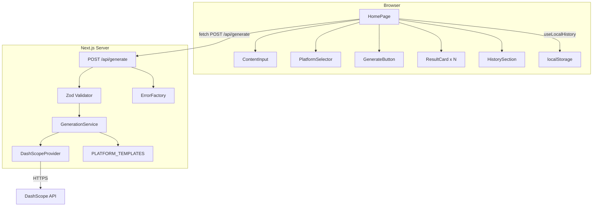
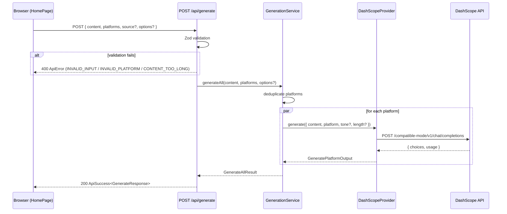
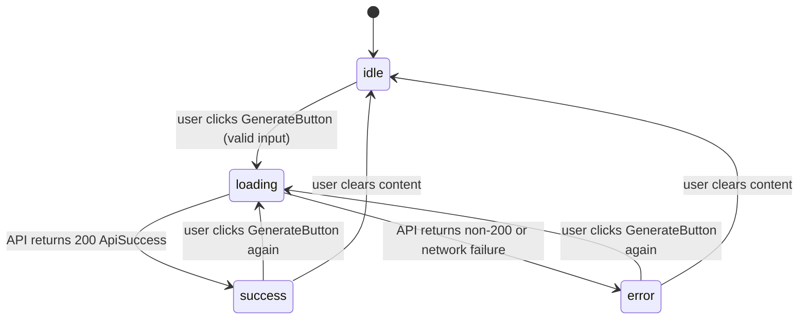

# Design Document: AutoContent Pro MVP (M1 P0)

## Overview

AutoContent Pro MVP is a server-rendered Next.js 16 (App Router) web application that converts a video script or description into platform-specific social media copy for up to 10 Chinese and international platforms in a single request. No authentication is required for the MVP.

The primary user flow is:
1. User pastes a video script into the ContentInput textarea
2. User selects one or more target platforms via PlatformSelector
3. User clicks GenerateButton — the browser POSTs to `/api/generate`
4. The server calls DashScope in parallel for each platform via `Promise.allSettled`
5. Results are rendered as ResultCards; the record is saved to localStorage

Key design goals:
- Strict separation between UI components, business logic (`lib/`), and API routes
- A single AI adapter interface so the upstream model can be swapped without touching business logic
- A unified `ApiSuccess<T>` / `ApiError` response envelope on every route
- Graceful partial failure: if some platforms fail, successful ones are still returned
- All inputs validated with Zod before reaching business logic

---

## Architecture

### High-Level Component Diagram



### Request Lifecycle



---

## Directory and File Structure (M1 P0 Scope)

```
src/
  app/
    layout.tsx                  # Root layout, lang="zh-CN", global styles
    page.tsx                    # Homepage — state machine, orchestrates components
    api/
      generate/
        route.ts                # POST /api/generate
  components/
    generate/
      ContentInput.tsx
      PlatformSelector.tsx
      GenerateButton.tsx
      ResultCard.tsx
    layout/
      Hero.tsx
  lib/
    ai/
      provider.ts               # AIProvider interface + DashScopeProvider
      templates.ts              # PLATFORM_TEMPLATES, SUPPORTED_PLATFORMS
    errors/
      index.ts                  # ERROR_CODES, ERROR_STATUS, ErrorFactory
    localHistory.ts             # LocalHistory (readHistory, prependHistory, clearHistory)
  types/
    index.ts                    # ApiSuccess, ApiError, GenerateResponse, shared types
tests/
  unit/
  integration/
  e2e/
supabase/
  migrations/
.env.example
```

---

## Components and Interfaces

### ContentInput

```typescript
interface ContentInputProps {
  value: string;
  onChange: (value: string) => void;
  disabled?: boolean;
  error?: string;
}
```

Renders a `<textarea>` with a live character counter (`{n} / 100000`). Validates on change: empty → required error, >100000 chars → length error. Exposes `error` prop so the parent page can also inject server-side errors.

### PlatformSelector

```typescript
interface PlatformSelectorProps {
  selected: PlatformCode[];
  onChange: (selected: PlatformCode[]) => void;
  disabled?: boolean;
}
```

Renders 10 platform cards in a responsive grid. Includes a "全选/取消全选" toggle. Each card shows `displayName` from `PLATFORM_TEMPLATES`. Selected state is controlled externally.

### GenerateButton

```typescript
interface GenerateButtonProps {
  onClick: () => void;
  loading: boolean;
  disabled: boolean;
}
```

Disabled when `loading` is true or `disabled` is true (zero platforms selected). Shows a spinner during loading.

### ResultCard

```typescript
interface ResultCardProps {
  platform: PlatformCode;
  result: GeneratePlatformOutput | null;
  error?: string;
}
```

Displays platform name, generated content, and hashtags. Includes a copy-to-clipboard button with inline success toast. When `result` is null and `error` is set, renders an error state.

---

## Data Models

### Shared Types (`src/types/index.ts`)

```typescript
export type PlatformCode =
  | 'douyin' | 'xiaohongshu' | 'bilibili' | 'weibo' | 'wechat'
  | 'twitter' | 'linkedin' | 'kuaishou' | 'zhihu' | 'toutiao';

export interface ApiSuccess<T> {
  success: true;
  data: T;
  requestId: string;   // "req_" + nanoid
  timestamp: string;   // ISO 8601
}

export interface ApiError {
  success: false;
  error: {
    code: string;
    message: string;
    details?: Record<string, unknown>;
  };
  requestId: string;
  timestamp: string;
}

export interface GeneratePlatformInput {
  content: string;
  platform: PlatformCode;
  tone?: 'professional' | 'casual' | 'humorous';
  length?: 'short' | 'medium' | 'long';
}

export interface GeneratePlatformOutput {
  title?: string;
  content: string;
  hashtags?: string[];
  tokensInput: number;
  tokensOutput: number;
  model: string;
}

export interface GenerateResponse {
  generationId: string;
  results: Partial<Record<PlatformCode, GeneratePlatformOutput>>;
  errors: Partial<Record<PlatformCode, string>>;
  durationMs: number;
  model: string;
  partialFailure: boolean;
}
```

### Platform Template (`src/lib/ai/templates.ts`)

```typescript
export interface PlatformTemplate {
  platform: PlatformCode;
  displayName: string;
  promptInstructions: string;
  maxTitleLength: number;
  maxContentLength: number;
  hashtagStyle: 'inline' | 'trailing' | 'none';
  promptVersion: string;
}

export const SUPPORTED_PLATFORMS: PlatformCode[] = [
  'douyin', 'xiaohongshu', 'bilibili', 'weibo', 'wechat',
  'twitter', 'linkedin', 'kuaishou', 'zhihu', 'toutiao',
];

export const PLATFORM_TEMPLATES: Record<PlatformCode, PlatformTemplate> = { ... };
```

### Error Codes (`src/lib/errors/index.ts`)

```typescript
export const ERROR_CODES = {
  INVALID_INPUT:        'INVALID_INPUT',
  INVALID_PLATFORM:     'INVALID_PLATFORM',
  CONTENT_TOO_LONG:     'CONTENT_TOO_LONG',
  UNAUTHORIZED:         'UNAUTHORIZED',
  PLAN_LIMIT_REACHED:   'PLAN_LIMIT_REACHED',
  CONTENT_BLOCKED:      'CONTENT_BLOCKED',
  RATE_LIMITED:         'RATE_LIMITED',
  AI_PROVIDER_ERROR:    'AI_PROVIDER_ERROR',
  SERVICE_UNAVAILABLE:  'SERVICE_UNAVAILABLE',
  INTERNAL_ERROR:       'INTERNAL_ERROR',
} as const;

export type ErrorCode = keyof typeof ERROR_CODES;

export const ERROR_STATUS: Record<ErrorCode, number> = {
  INVALID_INPUT:       400,
  INVALID_PLATFORM:    400,
  CONTENT_TOO_LONG:    400,
  UNAUTHORIZED:        401,
  PLAN_LIMIT_REACHED:  402,
  CONTENT_BLOCKED:     422,
  RATE_LIMITED:        429,
  AI_PROVIDER_ERROR:   500,
  SERVICE_UNAVAILABLE: 503,
  INTERNAL_ERROR:      500,
};
```

### LocalHistory (`src/lib/localHistory.ts`)

```typescript
export interface HistoryRecord {
  id: string;
  platforms: PlatformCode[];
  inputSnippet: string;   // first 100 chars of input
  createdAt: string;      // ISO 8601
  results: Partial<Record<PlatformCode, GeneratePlatformOutput>>;
}

export interface LocalHistory {
  readHistory(): HistoryRecord[];
  prependHistory(record: HistoryRecord): void;
  clearHistory(): void;
}
```

Stored under `localStorage` key `acp_history`. All operations are wrapped in try/catch and fail silently.

---

## AI Provider Adapter

### Interface

```typescript
// src/lib/ai/provider.ts
export interface AIProvider {
  generate(input: GeneratePlatformInput): Promise<GeneratePlatformOutput>;
}
```

### DashScopeProvider

```typescript
export class DashScopeProvider implements AIProvider {
  private readonly apiKey: string;
  private readonly model = 'qwen-plus';
  private readonly timeoutMs = 20_000;

  constructor() {
    const key = process.env.DASHSCOPE_API_KEY;
    if (!key) throw new Error('DASHSCOPE_API_KEY is not set');
    this.apiKey = key;
  }

  async generate(input: GeneratePlatformInput): Promise<GeneratePlatformOutput> {
    const template = PLATFORM_TEMPLATES[input.platform];
    const prompt = buildPrompt(template, input);
    // POST to https://dashscope.aliyuncs.com/compatible-mode/v1/chat/completions
    // with AbortSignal.timeout(this.timeoutMs)
    // on timeout or non-2xx: throw with code AI_PROVIDER_ERROR
  }
}
```

The provider uses the OpenAI-compatible endpoint exposed by DashScope. An `AbortSignal.timeout(20_000)` is attached to the fetch call to enforce the 20-second SLA. The API key is read from `process.env.DASHSCOPE_API_KEY` in the constructor and never serialized to the client.

---

## Generation Service

```typescript
// src/lib/ai/service.ts
export interface GenerateAllResult {
  results: Partial<Record<PlatformCode, GeneratePlatformOutput>>;
  errors: Partial<Record<PlatformCode, string>>;
  durationMs: number;
  model: string;
  partialFailure: boolean;
}

export async function generateAll(
  content: string,
  platforms: PlatformCode[],
  options?: { tone?: string; length?: string },
  provider: AIProvider = new DashScopeProvider(),
): Promise<GenerateAllResult>
```

Implementation notes:
- Deduplicates `platforms` with `[...new Set(platforms)]`
- Calls `provider.generate(...)` for each unique platform concurrently via `Promise.allSettled`
- Collects fulfilled results into `results` and rejected reasons into `errors`
- Sets `partialFailure = errors` has at least one entry
- Records wall-clock `durationMs` from start to `Promise.allSettled` resolution

---

## Error Factory

```typescript
// src/lib/errors/index.ts
export function generateRequestId(): string  // "req_" + nanoid(16)

export function createSuccess<T>(data: T, requestId: string): ApiSuccess<T>

export function createError(
  code: ErrorCode,
  message: string,
  requestId: string,
  details?: Record<string, unknown>,
): ApiError
```

`generateRequestId` uses `nanoid` (or `crypto.randomUUID`) to produce a collision-resistant identifier prefixed with `req_`.

---

## Homepage State Machine

### UIState

```typescript
type UIState = 'idle' | 'loading' | 'success' | 'error';

interface PageState {
  uiState: UIState;
  content: string;
  selectedPlatforms: PlatformCode[];
  response: GenerateResponse | null;
  errorMessage: string | null;
}
```

### Transitions



State is managed with `useReducer` in `page.tsx`. During `loading`, `ContentInput`, `PlatformSelector`, and `GenerateButton` all receive `disabled={true}`.

---

## Error Handling Flow

```
Request arrives at /api/generate
  │
  ├─ Zod parse fails → 400 INVALID_INPUT (field-level details in error.details)
  ├─ platforms contains unknown code → 400 INVALID_PLATFORM
  ├─ content.length > 100000 → 400 CONTENT_TOO_LONG
  │
  └─ generateAll() called
       ├─ All platforms fail → 500 AI_PROVIDER_ERROR
       ├─ Some platforms fail → 200 ApiSuccess with partialFailure=true
       └─ All succeed → 200 ApiSuccess with partialFailure=false

Every response path:
  - Generates requestId via generateRequestId()
  - Sets x-request-id response header
  - Includes timestamp (new Date().toISOString())
```

Client-side errors (network failure, non-JSON response) are caught in the `fetch` wrapper and transition the page to `error` state with a user-friendly message.

---

## Correctness Properties

*A property is a characteristic or behavior that should hold true across all valid executions of a system — essentially, a formal statement about what the system should do. Properties serve as the bridge between human-readable specifications and machine-verifiable correctness guarantees.*

### Property 1: Character count display accuracy

*For any* string of length n (where 0 ≤ n ≤ 100000), the ContentInput component's character counter must display exactly `"{n} / 100000"` and the stored value must equal the original string without truncation.

**Validates: Requirements 3.2, 3.5**

---

### Property 2: Over-limit input triggers error state

*For any* string whose length exceeds 100000 characters, the ContentInput component must enter an error state (error message visible) and the form submission must be blocked.

**Validates: Requirements 3.3**

---

### Property 3: Clear resets ContentInput state

*For any* ContentInput that has been populated with a non-empty string (including one in error state), setting the value to an empty string must reset the character count to zero and remove all error indicators.

**Validates: Requirements 3.6**

---

### Property 4: Platform cards display correct names

*For any* platform code in `SUPPORTED_PLATFORMS`, the PlatformSelector must render a card whose visible text includes the `displayName` from `PLATFORM_TEMPLATES[platform]`.

**Validates: Requirements 4.2**

---

### Property 5: Platform card toggle is idempotent over two clicks

*For any* platform code and any initial selection state, clicking the platform card twice must return the selection to its original state (click → selected, click again → deselected, or vice versa).

**Validates: Requirements 4.3**

---

### Property 6: All platform templates are complete and versioned

*For any* platform code in `SUPPORTED_PLATFORMS`, `PLATFORM_TEMPLATES` must contain an entry with all required fields (`platform`, `displayName`, `promptInstructions`, `maxTitleLength`, `maxContentLength`, `hashtagStyle`, `promptVersion`) and `promptVersion` must be a non-empty string.

**Validates: Requirements 5.3, 5.5**

---

### Property 7: Unknown platform codes produce INVALID_PLATFORM error

*For any* string that is not a member of `SUPPORTED_PLATFORMS`, passing it as a platform code to the generation service or the `/api/generate` endpoint must produce an error with code `INVALID_PLATFORM` and HTTP status 400.

**Validates: Requirements 5.4, 9.4**

---

### Property 8: DashScope error responses map to AI_PROVIDER_ERROR

*For any* non-2xx HTTP status returned by the DashScope API, `DashScopeProvider.generate` must throw an error whose code is `AI_PROVIDER_ERROR`.

**Validates: Requirements 6.5**

---

### Property 9: Generation service partial failure invariant

*For any* set of platforms where at least one succeeds and at least one fails, `generateAll` must return `partialFailure: true`, include all successful platform outputs in `results`, and include all failed platform codes in `errors`. Conversely, when all platforms succeed, `partialFailure` must be `false` and `results` must contain every requested platform.

**Validates: Requirements 7.2, 7.3**

---

### Property 10: Generation service deduplicates platforms

*For any* platforms array containing duplicate codes, `generateAll` must invoke the AI provider exactly once per unique platform code (i.e., `provider.generate` call count equals the number of distinct codes).

**Validates: Requirements 7.5**

---

### Property 11: Request ID uniqueness and prefix

*For any* two calls to `generateRequestId()`, the returned strings must both start with `"req_"` and must not be equal to each other.

**Validates: Requirements 8.3**

---

### Property 12: API response always contains requestId, timestamp, and matching header

*For any* request to `POST /api/generate` (valid or invalid), the response body must contain `requestId` (starting with `"req_"`) and `timestamp` (valid ISO 8601 string), and the `x-request-id` response header must equal the `requestId` in the body.

**Validates: Requirements 9.7, 9.8**

---

### Property 13: LocalHistory cap and round-trip

*For any* sequence of N successful generations (N > 10), `readHistory()` must return exactly 10 records, the most recently prepended record must be first, and each record must contain all required fields (`id`, `platforms`, `inputSnippet`, `createdAt`, `results`). Furthermore, for any single record written via `prependHistory`, `readHistory` must return a list whose first element has the same `id`.

**Validates: Requirements 11.1, 11.2, 11.3, 11.5**

---

## Error Handling

### Validation Layer (Zod)

The `/api/generate` route parses the request body with a Zod schema before any business logic runs. Zod's `safeParse` is used so errors can be mapped to structured `ApiError` responses:

- `content` missing or empty → `INVALID_INPUT`
- `content.length > 100000` → `CONTENT_TOO_LONG`
- `platforms` contains unknown code → `INVALID_PLATFORM`
- Any other schema violation → `INVALID_INPUT` with `details` containing Zod's `ZodError.flatten()` output

### Service Layer

`generateAll` uses `Promise.allSettled` so individual platform failures never throw. The caller (route handler) inspects the result:

- All entries rejected → return `500 AI_PROVIDER_ERROR`
- Mixed → return `200 ApiSuccess` with `partialFailure: true`
- All fulfilled → return `200 ApiSuccess` with `partialFailure: false`

### Client Layer

The `fetch` call in `page.tsx` is wrapped in try/catch:

- Network error / non-JSON body → transition to `error` state with a generic message
- `response.ok === false` → parse `ApiError` body and display `error.message`
- `partialFailure === true` → stay in `success` state but render per-platform error indicators

### Silent Failures

`LocalHistory` wraps every `localStorage` call in try/catch and returns safe defaults (`[]` for reads, no-op for writes) when storage is unavailable (e.g., private browsing, quota exceeded).

---

## Testing Strategy

### Overview

The project uses **Vitest** as the test runner and **fast-check** as the property-based testing library. Both unit tests and property tests are required; they are complementary.

- Unit tests: specific examples, integration points, edge cases, error conditions
- Property tests: universal properties across randomly generated inputs (minimum 100 iterations each)

### Property-Based Testing (fast-check)

Each correctness property from the section above maps to exactly one property-based test. Tests are tagged with a comment referencing the design property.

| Test ID | Property | fast-check Arbitraries | Validates |
|---------|----------|------------------------|-----------|
| PBT-1 | Character count display accuracy | `fc.string({ maxLength: 100000 })` | Req 3.2, 3.5 |
| PBT-2 | Over-limit input triggers error | `fc.string({ minLength: 100001 })` | Req 3.3 |
| PBT-3 | Clear resets ContentInput state | `fc.string({ minLength: 1 })` | Req 3.6 |
| PBT-4 | Platform cards display correct names | `fc.constantFrom(...SUPPORTED_PLATFORMS)` | Req 4.2 |
| PBT-5 | Platform card toggle idempotent | `fc.constantFrom(...SUPPORTED_PLATFORMS)` | Req 4.3 |
| PBT-6 | All templates complete and versioned | `fc.constantFrom(...SUPPORTED_PLATFORMS)` | Req 5.3, 5.5 |
| PBT-7 | Unknown platform → INVALID_PLATFORM | `fc.string().filter(s => !SUPPORTED_PLATFORMS.includes(s))` | Req 5.4, 9.4 |
| PBT-8 | DashScope error → AI_PROVIDER_ERROR | `fc.integer({ min: 400, max: 599 })` | Req 6.5 |
| PBT-9 | Partial failure invariant | `fc.array(fc.constantFrom(...SUPPORTED_PLATFORMS), { minLength: 1 })` + mock outcomes | Req 7.2, 7.3 |
| PBT-10 | Deduplication of platforms | `fc.array(fc.constantFrom(...SUPPORTED_PLATFORMS), { minLength: 1 })` with duplicates | Req 7.5 |
| PBT-11 | requestId uniqueness and prefix | `fc.integer({ min: 2, max: 100 })` (call count) | Req 8.3 |
| PBT-12 | Response always has requestId + header | `fc.record({ content: fc.string(), platforms: fc.array(...) })` | Req 9.7, 9.8 |
| PBT-13 | LocalHistory cap and round-trip | `fc.array(fc.record({...}), { minLength: 1, maxLength: 20 })` | Req 11.1–11.5 |

Each test must be configured with at least 100 runs:

```typescript
// Feature: autocontent-pro-mvp, Property 11: requestId uniqueness and prefix
it('generates unique req_-prefixed IDs', () => {
  fc.assert(
    fc.property(fc.integer({ min: 2, max: 100 }), (n) => {
      const ids = Array.from({ length: n }, generateRequestId);
      expect(ids.every(id => id.startsWith('req_'))).toBe(true);
      expect(new Set(ids).size).toBe(n);
    }),
    { numRuns: 100 },
  );
});
```

### Unit Tests

Unit tests focus on specific examples and integration points that property tests do not cover well:

| File | What to test |
|------|-------------|
| `tests/unit/errors.test.ts` | `createSuccess`, `createError` shape; all 10 ERROR_CODES present; ERROR_STATUS mapping |
| `tests/unit/templates.test.ts` | SUPPORTED_PLATFORMS has exactly 10 entries; each template has required fields |
| `tests/unit/history.test.ts` | Silent failure on unavailable localStorage; `clearHistory` empties the list |
| `tests/unit/provider.test.ts` | Timeout after 20s (mock AbortSignal); successful response maps to GeneratePlatformOutput |
| `tests/unit/service.test.ts` | All-fail → partialFailure=true, no results; durationMs is a positive number |

### Integration Tests

| File | What to test |
|------|-------------|
| `tests/integration/generate.test.ts` | Valid POST → 200 with correct shape; invalid body → 400 INVALID_INPUT; content too long → 400 CONTENT_TOO_LONG; all platforms fail → 500 AI_PROVIDER_ERROR; x-request-id header matches body requestId |

Integration tests use `next/test` or `msw` to mock the DashScope API and test the full route handler without a live network call.

### End-to-End Tests

E2E tests (Playwright) cover the happy path and the partial failure path:

- Happy path: paste script → select 3 platforms → click generate → 3 ResultCards rendered
- Partial failure: 1 of 3 platforms fails → 2 ResultCards + 1 error indicator
- History: after generation, history section shows the new record; clicking it restores results
