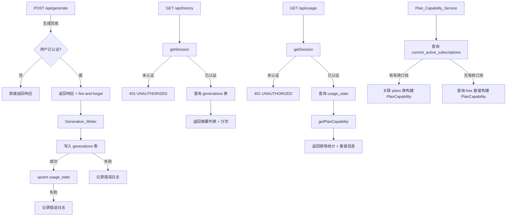
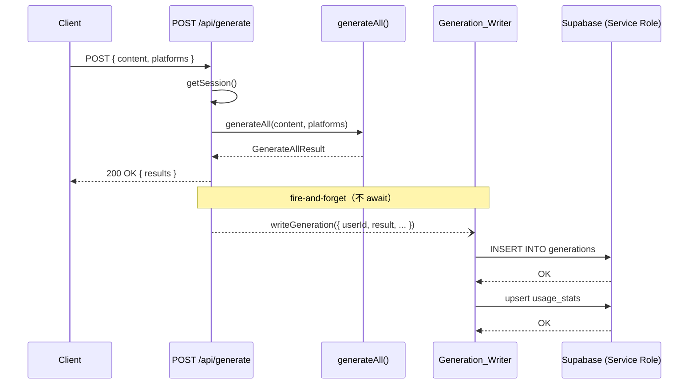
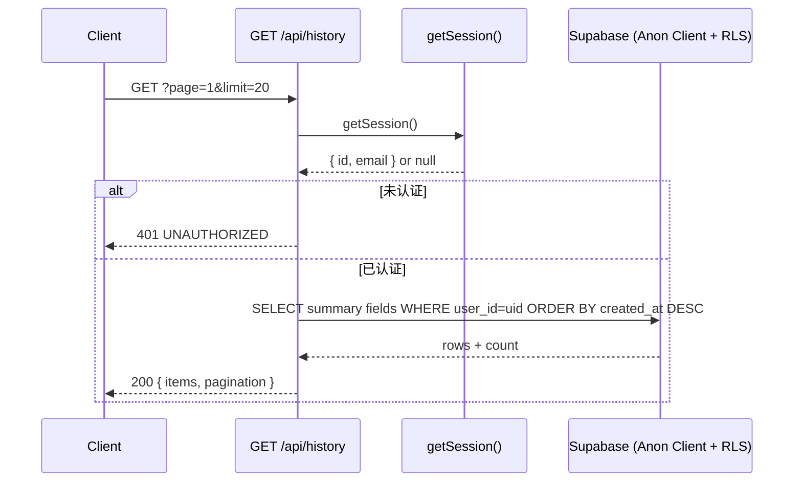
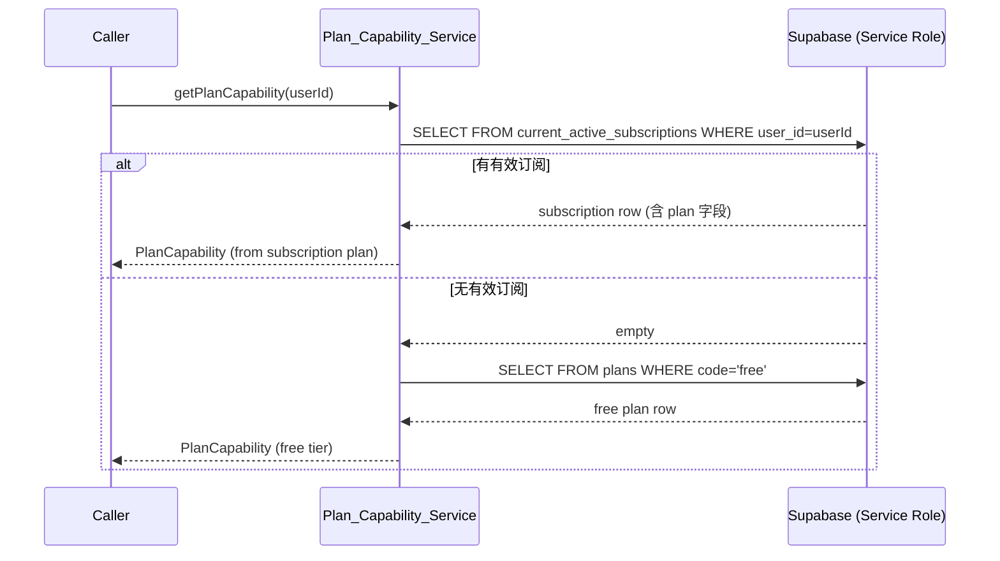

# 设计文档：cloud-data-plan-foundation

## 概述

本阶段在已有的 Supabase 基础设施和用户认证之上，构建云端数据层与套餐能力读取服务。
核心目标是：将已认证用户的生成记录异步持久化到数据库、提供历史记录和使用统计 API、
以及封装套餐能力读取逻辑，为第四阶段的限制执行提供统一接口。

**设计决策：**
- 数据库写入为 fire-and-forget（非阻塞），生成结果优先返回给用户，写入失败不影响核心体验。
- 匿名用户生成请求不写入数据库，直接跳过 Generation_Writer。
- 历史记录页仅支持分页，不提供平台/状态筛选 UI（API 层保留参数以备后用）。
- Plan_Capability_Service 只读取套餐能力，不执行任何限制逻辑。

---

## 架构



---

## 组件与接口

### Generation_Writer（`src/lib/db/generation-writer.ts`）

负责在生成完成后异步写入数据库，对调用方完全透明（fire-and-forget）。

```typescript
interface WriteGenerationParams {
  userId: string;
  requestId: string;
  content: string;
  platforms: PlatformCode[];
  source: 'manual' | 'extract';
  result: GenerateAllResult;
  promptVersion?: string;
}

/**
 * 异步写入 generations 表并更新 usage_stats。
 * 永不抛出异常，所有错误通过结构化日志记录。
 */
export function writeGeneration(params: WriteGenerationParams): void;
```

内部流程：
1. 若 `userId` 为空，立即返回（匿名用户跳过）。
2. 根据 `result` 计算 `status`、`result_json`、`error_code`、`error_message`。
3. 使用 Service_Role_Client 插入 `generations` 表。
4. 若插入成功，调用 `upsertUsageStats(userId, requestId)`。
5. 任何步骤失败均记录结构化错误日志，不抛出异常。

```typescript
// status 计算逻辑
function resolveStatus(result: GenerateAllResult): 'success' | 'partial' | 'failed' {
  const successCount = Object.keys(result.results).length;
  const failCount = Object.keys(result.errors).length;
  if (successCount > 0 && failCount === 0) return 'success';
  if (successCount > 0 && failCount > 0) return 'partial';
  return 'failed';
}
```

### upsertUsageStats（`src/lib/db/usage-stats.ts`）

```typescript
export async function upsertUsageStats(
  userId: string,
  requestId: string,
): Promise<void>;
```


upsert 逻辑（在应用层实现，避免依赖数据库存储过程）：
1. 读取当前月份字符串 `YYYY-MM`。
2. 查询 `usage_stats` 中该用户的现有行。
3. 若不存在：插入新行，`monthly_generation_count=1`，`total_generation_count=1`，`current_month=当前月份`。
4. 若存在且 `current_month` 一致：`monthly_generation_count += 1`，`total_generation_count += 1`。
5. 若存在但 `current_month` 不一致（跨月）：`current_month=当前月份`，`monthly_generation_count=1`，`total_generation_count += 1`。
6. 更新 `last_generation_at = now()`。

所有操作使用 Service_Role_Client，失败时记录日志但不抛出异常。

### Service_Role_Client（`src/lib/db/client.ts`）

```typescript
import { createClient } from '@supabase/supabase-js';

/**
 * 使用 SUPABASE_SERVICE_ROLE_KEY 初始化的客户端，绕过 RLS。
 * 仅用于服务端写操作，永不暴露给客户端。
 */
export function createServiceRoleClient() {
  return createClient(
    process.env.SUPABASE_URL!,
    process.env.SUPABASE_SERVICE_ROLE_KEY!,
  );
}
```

### Plan_Capability_Service（`src/lib/billing/plan-capability.ts`）

```typescript
export interface PlanCapability {
  planCode: string;
  displayName: string;
  maxPlatforms: number | null;           // null = 无限制
  monthlyGenerationLimit: number | null; // null = 无限制
  canUseHistory: boolean;
  canUseApi: boolean;
  canUseTeam: boolean;
  speedTier: 'standard' | 'fast' | 'priority' | 'dedicated';
}

/**
 * 根据用户当前有效订阅返回套餐能力对象。
 * 无有效订阅时回退到 free 套餐。
 * 查询失败时抛出异常，由调用方决定降级策略。
 */
export async function getPlanCapability(userId: string): Promise<PlanCapability>;
```

内部流程：
1. 使用 Service_Role_Client 查询 `current_active_subscriptions` 视图，过滤 `user_id = userId`。
2. 若存在有效订阅行，直接从视图中读取关联套餐字段（视图已 JOIN `plans`）。
3. 若不存在，查询 `plans` 表中 `code = 'free'` 的行。
4. 将数据库字段映射为 `PlanCapability` 对象并返回。
5. 任何数据库错误直接抛出，不静默吞掉。

### GET /api/history（`src/app/api/history/route.ts`）

```typescript
// 查询参数 schema（Zod）
const querySchema = z.object({
  page:     z.coerce.number().int().min(1).default(1),
  limit:    z.coerce.number().int().min(1).max(100).default(20),
  platform: z.string().optional(),
  status:   z.enum(['success', 'failed', 'partial']).optional(),
});
```

处理流程：
1. `getSession()` → 未认证返回 401。
2. 解析并验证查询参数 → 非法返回 400。
3. 使用 Anon_Client（携带用户 session）查询 `generations` 表，RLS 自动过滤 `user_id`。
4. 查询字段：`id, input_source, platforms, platform_count, status, model_name, duration_ms, created_at`（不含 `input_content`、`result_json`）。
5. 排序：`created_at DESC`；分页：`range((page-1)*limit, page*limit-1)`。
6. 同时执行 `count` 查询获取 `total`。
7. 返回 `ApiSuccess<{ items, pagination }>`。

### GET /api/usage（`src/app/api/usage/route.ts`）

处理流程：
1. `getSession()` → 未认证返回 401。
2. 并行查询：`usage_stats`（Anon_Client，RLS 过滤）+ `getPlanCapability(userId)`。
3. 若 `usage_stats` 无记录，返回零值默认对象。
4. 返回 `ApiSuccess<UsageData>`。

---

## 数据模型

### GenerationRecord（写入 `generations` 表的字段映射）

| 应用层字段 | 数据库列 | 来源 |
|---|---|---|
| `userId` | `user_id` | `getSession().id` |
| `inputSource` | `input_source` | 请求参数 `source` |
| `inputContent` | `input_content` | 请求参数 `content` |
| `platforms` | `platforms` | 请求参数 `platforms`（text[]） |
| `platformCount` | `platform_count` | `platforms.length` |
| `resultJson` | `result_json` | `result.results`（成功平台输出） |
| `promptVersion` | `prompt_version` | 可选，默认 `'v1'` |
| `modelName` | `model_name` | `result.model` |
| `tokensInput` | `tokens_input` | 各平台 `tokensInput` 之和 |
| `tokensOutput` | `tokens_output` | 各平台 `tokensOutput` 之和 |
| `durationMs` | `duration_ms` | `result.durationMs` |
| `status` | `status` | `resolveStatus(result)` |
| `errorCode` | `error_code` | 全部失败时的错误码，否则 NULL |
| `errorMessage` | `error_message` | 失败平台列表或失败原因，否则NULL |

### HistorySummaryItem（GET /api/history 列表项）

```typescript
interface HistorySummaryItem {
  id: string;
  inputSource: 'manual' | 'extract';
  platforms: string[];
  platformCount: number;
  status: 'success' | 'partial' | 'failed';
  modelName: string | null;
  durationMs: number;
  createdAt: string; // ISO 8601
}
```

### UsageData（GET /api/usage 响应 data 字段）

```typescript
interface UsageData {
  currentMonth: string;              // YYYY-MM
  monthlyGenerationCount: number;
  totalGenerationCount: number;
  lastGenerationAt: string | null;   // ISO 8601 or null
  plan: {
    code: string;
    displayName: string;
    monthlyGenerationLimit: number | null;
    platformLimit: number | null;
    speedTier: string;
  };
}
```

### PlanCapability（`src/types/index.ts` 中新增）

```typescript
export interface PlanCapability {
  planCode: string;
  displayName: string;
  maxPlatforms: number | null;
  monthlyGenerationLimit: number | null;
  canUseHistory: boolean;
  canUseApi: boolean;
  canUseTeam: boolean;
  speedTier: 'standard' | 'fast' | 'priority' | 'dedicated';
}
```

---

## 关键序列图

### 生成请求写入流程



### GET /api/history 流程



### getPlanCapability 流程



---

## Dashboard 组件结构

### History_Page（`src/app/dashboard/history/page.tsx`）

服务端组件，通过 Middleware 保护（未认证自动重定向至 `/login`）。

```
HistoryPage (Server Component)
├── 调用 GET /api/history（通过 fetch 或直接调用 db 层）
├── HistoryList
│   ├── HistoryItem × N
│   │   ├── 生成时间（createdAt，格式化为本地时间）
│   │   ├── 平台标签列表（platforms）
│   │   ├── 状态徽章（status: success/partial/failed）
│   │   └── 生成耗时（durationMs，格式化为秒）
│   └── EmptyState（当 items 为空时）
│       └── 引导用户前往首页生成的提示 + 链接
├── Pagination
│   ├── 上一页 / 下一页按钮
│   └── 当前页码 / 总页数显示
└── ErrorState（当 API 返回错误时）
    └── 错误提示信息
```

状态处理：
- 加载中：使用 React Suspense + loading.tsx 骨架屏。
- 空状态：`items.length === 0` 时渲染 `EmptyState`。
- 错误状态：使用 Next.js `error.tsx` 边界捕获，渲染错误提示。

### Usage_Card（`src/components/dashboard/UsageCard.tsx`）

客户端组件，在 Dashboard 首页嵌入，独立加载不阻塞其他区域。

```
UsageCard (Client Component)
├── 加载中：SkeletonCard（骨架屏占位）
├── 错误状态：ErrorBanner（独立错误提示，不影响父页面）
└── 正常状态：
    ├── 套餐名称（displayName）+ 速度等级徽章（speedTier）
    ├── 本月使用次数（monthlyGenerationCount）
    ├── 若 monthlyGenerationLimit 不为 null：
    │   ├── 进度条（已用 / 限额）
    │   └── 数值对比文字（"18 / 30 次"）
    └── 若 monthlyGenerationLimit 为 null：
        └── 显示"无限制"
```

数据获取：组件挂载后调用 `GET /api/usage`，使用 `useState` + `useEffect` 管理加载/错误/数据状态。

---

## 正确性属性

*属性（Property）是在系统所有合法执行路径上都应成立的特征或行为——本质上是对系统应做什么的形式化陈述。属性是人类可读规范与机器可验证正确性保证之间的桥梁。*

### 属性 1：写入记录完整性

*对于任意*已认证用户的生成请求，调用 `writeGeneration` 后，`generations` 表中应存在一条记录，且该记录的 `user_id`、`platforms`、`platform_count`、`status`、`model_name`、`duration_ms` 字段与输入参数一致。

**验证需求：1.1、1.5**

### 属性 2：status 字段映射

*对于任意*生成结果，`resolveStatus` 函数应满足：全部成功 → `'success'`；部分成功 → `'partial'`；全部失败 → `'failed'`。且全部失败时 `result_json` 为空对象 `{}`，部分失败时 `result_json` 仅包含成功平台的输出。

**验证需求：1.2、1.3、1.4**

### 属性 3：匿名用户不写入

*对于任意*匿名用户（`userId` 为 null 或空字符串）的生成请求，调用 `writeGeneration` 后，`generations` 表中不应新增任何记录。

**验证需求：1.7**

### 属性 4：写入失败不影响生成响应

*对于任意*生成请求，即使 `generations` 表写入失败（模拟数据库错误），`POST /api/generate` 路由仍应向客户端返回 HTTP 200 及生成结果。

**验证需求：1.6、8.2**

### 属性 5：usage_stats 计数器递增

*对于任意*已认证用户，在同一自然月内每次成功写入 `generations` 后，`usage_stats` 中该用户的 `monthly_generation_count` 和 `total_generation_count` 均应各增加 1，且 `last_generation_at` 更新为最新时间戳。首次写入时应创建新行，初始值为 1。

**验证需求：2.1、2.2、2.3**

### 属性 6：月份切换重置月度计数

*对于任意*已认证用户，当 `usage_stats` 中 `current_month` 与当前月份不一致时，调用 upsert 后 `monthly_generation_count` 应重置为 1，`total_generation_count` 应在原值基础上加 1，`current_month` 应更新为当前月份。

**验证需求：2.4**

### 属性 7：usage_stats 失败不回滚 generations

*对于任意*已认证用户，若 `usage_stats` upsert 失败，`generations` 表中已写入的记录不应被删除或修改。

**验证需求：2.5、8.3**

### 属性 8：历史记录数据隔离与排序

*对于任意*两个不同的已认证用户，`GET /api/history` 返回的记录集合应互不相交（用户 A 看不到用户 B 的记录），且返回列表按 `created_at DESC` 严格排序。

**验证需求：3.1、3.7、3.8**

### 属性 9：历史记录摘要字段安全

*对于任意*历史记录列表响应，每个列表项均不应包含 `input_content` 或 `result_json` 字段。

**验证需求：3.4**

### 属性 10：分页参数约束

*对于任意*合法的 `page`（≥1）和 `limit`（1-100）参数，`GET /api/history` 返回的 `items` 数量应 ≤ `limit`，且 `pagination.hasMore` 应等于 `(page * limit) < total`。

**验证需求：3.2、3.3**

### 属性 11：非法分页参数返回 400

*对于任意*非正整数的 `page` 或超过 100 的 `limit` 参数，`GET /api/history` 应返回 HTTP 400 及错误码 `INVALID_INPUT`。

**验证需求：3.6**

### 属性 12：历史记录列表项渲染完整性

*对于任意* `HistorySummaryItem` 数据，`HistoryItem` 组件渲染后的 DOM 应包含 `createdAt`（格式化时间）、`platforms`（平台标签）、`status`（状态徽章）、`durationMs`（耗时）的可见文本。

**验证需求：4.2**

### 属性 13：usage 响应完整性

*对于任意*已认证用户，`GET /api/usage` 的响应 `data` 字段应包含 `currentMonth`、`monthlyGenerationCount`、`totalGenerationCount`、`lastGenerationAt`、`plan.code`、`plan.displayName`、`plan.monthlyGenerationLimit`、`plan.speedTier` 所有字段，且响应顶层包含 `requestId` 和 `timestamp`。

**验证需求：5.1、5.2、5.5**

### 属性 14：UsageCard 渲染完整性

*对于任意* `UsageData` 数据，`UsageCard` 组件渲染后的 DOM 应包含套餐名称（`displayName`）、速度等级（`speedTier`）、本月生成次数（`monthlyGenerationCount`）的可见文本。

**验证需求：6.1、6.2**

### 属性 15：UsageCard 有限额时显示进度

*对于任意* `monthlyGenerationLimit` 不为 null 的 `UsageData`，`UsageCard` 渲染后应包含进度条或数值对比元素；当 `monthlyGenerationLimit` 为 null 时，应显示"无限制"文本。

**验证需求：6.3**

### 属性 16：PlanCapability 字段完整性

*对于任意*用户 ID，`getPlanCapability` 返回的对象应包含 `maxPlatforms`、`monthlyGenerationLimit`、`canUseHistory`、`canUseApi`、`canUseTeam`、`speedTier` 所有字段，且字段值与数据库中对应套餐行的字段一致。无有效订阅时应回退到 `free` 套餐的字段值。

**验证需求：7.1、7.3、7.4、7.5**

### 属性 17：非阻塞写入

*对于任意*生成请求，`POST /api/generate` 路由的响应时间不应因 `writeGeneration` 的数据库操作延迟而增加（即写入操作在响应发送后才执行，不在响应路径上）。

**验证需求：8.1**

---

## 错误处理

| 场景 | 处理策略 |
|---|---|
| `generations` 写入失败 | 记录结构化错误日志（含 `requestId`、`userId`、`errorCode`），不抛出，不影响 API 响应 |
| `usage_stats` upsert 失败 | 记录结构化错误日志，不回滚已写入的 `generations` 记录 |
| `getPlanCapability` 数据库失败 | 抛出异常，由 `/api/usage` 路由捕获并返回 500 |
| `GET /api/history` 未认证 | 返回 HTTP 401，错误码 `UNAUTHORIZED` |
| `GET /api/history` 参数非法 | 返回 HTTP 400，错误码 `INVALID_INPUT` |
| `GET /api/usage` 未认证 | 返回 HTTP 401，错误码 `UNAUTHORIZED` |
| `GET /api/usage` 无 usage_stats 记录 | 返回零值默认对象，不报错 |
| `UsageCard` API 失败 | 组件内独立显示错误提示，不影响 Dashboard 其他区域 |
| `HistoryPage` API 失败 | Next.js `error.tsx` 边界捕获，显示错误提示页 |

---

## 测试策略

### 双轨测试方法

本阶段采用单元测试 + 属性测试的双轨策略，两者互补：
- 单元测试：验证具体示例、边界情况、错误条件。
- 属性测试：验证跨所有输入的通用属性，通过随机化实现全面覆盖。

### 属性测试配置

- 属性测试库：[fast-check](https://github.com/dubzzz/fast-check)（TypeScript 原生支持）
- 每个属性测试最少运行 **100 次迭代**
- 每个属性测试必须通过注释引用设计文档中的属性编号
- 标签格式：`// Feature: cloud-data-plan-foundation, Property {N}: {属性描述}`
- 每个正确性属性由**一个**属性测试实现

### 单元测试（`tests/unit/`）

重点覆盖：
- `resolveStatus()` 函数的三种分支（全成功、部分失败、全失败）
- `writeGeneration()` 匿名用户跳过逻辑
- `getPlanCapability()` 有订阅 / 无订阅两种路径
- `GET /api/history` 参数验证（非法 page/limit）
- `GET /api/history` 未认证返回 401
- `GET /api/usage` 未认证返回 401
- `GET /api/usage` 无 usage_stats 记录时返回零值
- `UsageCard` 加载状态、错误状态、有限额/无限额渲染
- `HistoryItem` 空状态渲染

### 属性测试（`tests/unit/cloud-data-plan-foundation/`）

| 属性 | 测试描述 | 生成器 |
|---|---|---|
| P2 | status 字段映射 | 随机 `results`/`errors` 组合 |
| P3 | 匿名用户不写入 | 随机生成结果 + null userId |
| P5 | usage_stats 计数器递增 | 随机用户 + 随机调用次数 |
| P6 | 月份切换重置 | 随机历史月份字符串 |
| P8 | 历史记录数据隔离 | 随机两用户 + 随机记录集合 |
| P9 | 摘要字段安全 | 随机 generations 记录 |
| P10 | 分页参数约束 | 随机合法 page/limit + 随机记录数 |
| P11 | 非法参数返回 400 | 随机非法 page/limit 值 |
| P12 | 列表项渲染完整性 | 随机 HistorySummaryItem |
| P13 | usage 响应完整性 | 随机 UsageData |
| P14 | UsageCard 渲染完整性 | 随机 UsageData |
| P15 | 有限额时显示进度 | 随机有限额 / 无限额 UsageData |
| P16 | PlanCapability 字段完整性 | 随机 plans 行数据 |

### 集成测试（`tests/integration/`）

- `writeGeneration` 端到端写入（需要真实 Supabase 测试实例）
- `GET /api/history` 完整请求-响应链路
- `GET /api/usage` 完整请求-响应链路
- `getPlanCapability` 有订阅 / 无订阅路径（需要真实数据库）
