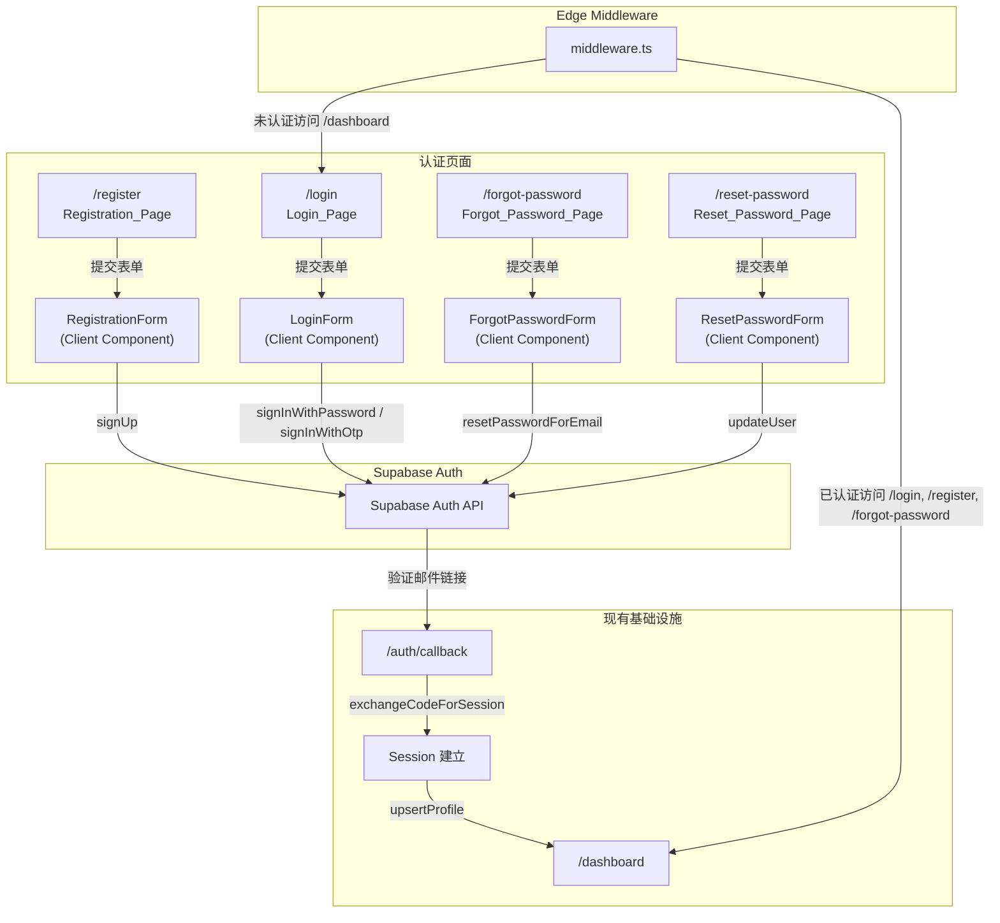
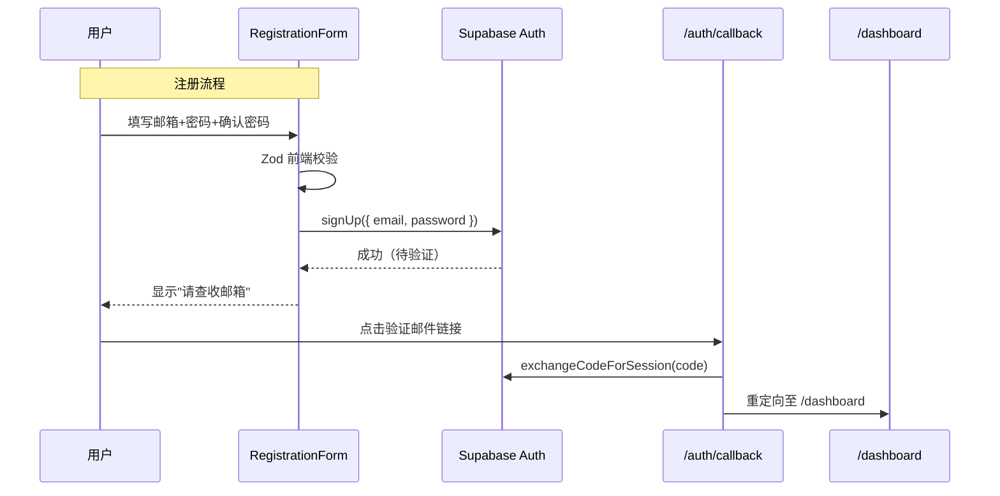
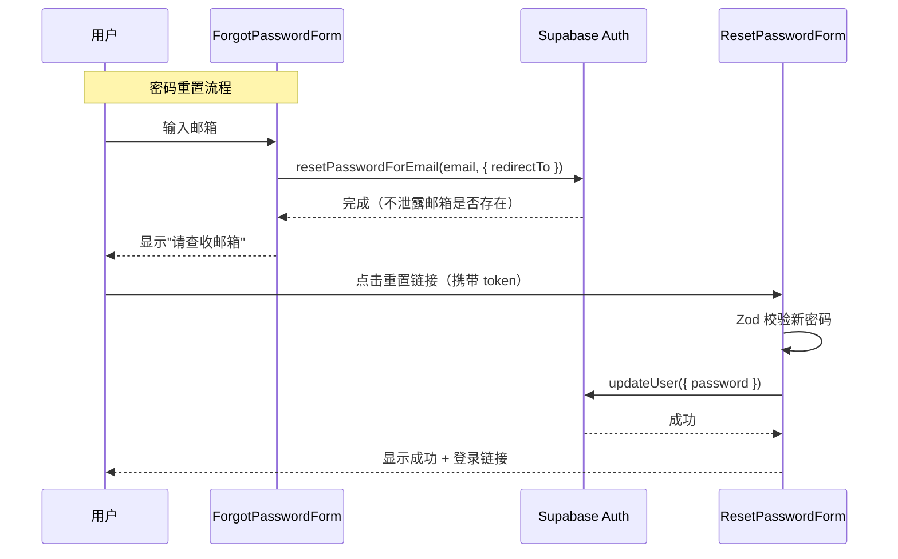

# 设计文档：邮箱+密码认证

## 概述

本设计在现有 `user-authentication` spec 基础上，为 AutoContent Pro 新增邮箱+密码认证能力。核心变更包括：

1. **新增注册流程**：`/register` 页面 + `RegistrationForm` 客户端组件
2. **重构登录页**：邮箱+密码为默认登录方式，magic link 降级为次要选项
3. **新增密码重置流程**：`/forgot-password` 请求重置 + `/reset-password` 设置新密码
4. **统一密码校验**：基于 Zod 的 `passwordSchema`，注册和重置密码共用
5. **路由保护扩展**：Middleware matcher 覆盖新增认证路由

设计原则：
- 最大化复用现有 Auth 基础设施（`createSupabaseBrowserClient`、`createSupabaseServerClient`、`getSession`、`upsertProfile`、Auth Callback）
- 遵循项目约定：Server Component 优先，Client Component 仅用于交互式表单
- 所有输入使用 Zod 校验，错误信息为中文
- 不引入新的第三方依赖

## 架构

### 整体流程



### 技术决策

| 决策 | 选择 | 理由 |
|------|------|------|
| 密码登录 API | `supabase.auth.signInWithPassword` | Supabase 原生支持，无需自建认证逻辑 |
| 注册 API | `supabase.auth.signUp` | 自动发送验证邮件，支持 PKCE 回调 |
| 密码重置 | `resetPasswordForEmail` + `updateUser` | Supabase 标准流程，邮件由 Supabase 托管发送 |
| 密码校验 | Zod schema（`src/lib/validations/auth.ts`） | 与项目现有校验模式一致，前后端可共用 |
| 表单状态管理 | React `useState` | 与现有 `LoginForm` 模式一致，无需引入额外状态库 |
| 页面渲染策略 | Server Component 页面 + Client Component 表单 | 符合需求 7.6 / 8.2，最大化 SSR 优势 |


## 组件与接口

### 新增文件

#### 1. `src/lib/validations/auth.ts` — 密码校验 Schema

统一的密码校验模块，供注册和重置密码共用。

```typescript
// 接口定义
export const passwordSchema: z.ZodString;       // 最少8字符，至少1字母+1数字
export const emailSchema: z.ZodString;          // 有效邮箱格式

export const registerFormSchema: z.ZodObject<{
  email: z.ZodString;
  password: z.ZodString;
  confirmPassword: z.ZodString;
}>;  // 含 .refine() 校验两次密码一致

export const loginFormSchema: z.ZodObject<{
  email: z.ZodString;
  password: z.ZodString;
}>;

export const forgotPasswordFormSchema: z.ZodObject<{
  email: z.ZodString;
}>;

export const resetPasswordFormSchema: z.ZodObject<{
  password: z.ZodString;
  confirmPassword: z.ZodString;
}>;  // 含 .refine() 校验两次密码一致
```

#### 2. `src/components/auth/RegistrationForm.tsx` — 注册表单（Client Component）

```typescript
'use client';
// 状态：email, password, confirmPassword, uiState, fieldErrors, serverError
// 提交流程：Zod 校验 → signUp → 显示确认信息
// UI 状态机：idle → loading → success | error
export default function RegistrationForm(): JSX.Element;
```

#### 3. `src/components/auth/LoginForm.tsx` — 重构登录表单（Client Component）

重构现有 `LoginForm`，默认 `authMode` 改为 `'password'`，增加忘记密码链接。

```typescript
'use client';
// 变更：authMode 默认值从 'magic-link' 改为 'password'
// 新增：密码登录模式下显示"忘记密码？"链接
// 保留：magic link 模式切换功能
export default function LoginForm(): JSX.Element;
```

#### 4. `src/components/auth/ForgotPasswordForm.tsx` — 忘记密码表单（Client Component）

```typescript
'use client';
// 状态：email, uiState, validationError
// 提交流程：Zod 校验 → resetPasswordForEmail → 显示确认信息
// 安全：无论邮箱是否存在，均显示相同确认信息
export default function ForgotPasswordForm(): JSX.Element;
```

#### 5. `src/components/auth/ResetPasswordForm.tsx` — 重置密码表单（Client Component）

```typescript
'use client';
// 状态：password, confirmPassword, uiState, fieldErrors, serverError
// 提交流程：Zod 校验 → updateUser → 显示成功信息 + 登录链接
export default function ResetPasswordForm(): JSX.Element;
```

#### 6. 新增页面（Server Components）

| 路径 | 文件 | 职责 |
|------|------|------|
| `/register` | `src/app/(auth)/register/page.tsx` | 渲染产品名称 + 注册说明 + `<RegistrationForm />` + noscript 提示 + 登录链接 |
| `/forgot-password` | `src/app/(auth)/forgot-password/page.tsx` | 渲染 `<ForgotPasswordForm />` + noscript 提示 + 返回登录链接 |
| `/reset-password` | `src/app/(auth)/reset-password/page.tsx` | 渲染 `<ResetPasswordForm />` + noscript 提示 |

#### 7. `src/app/(auth)/login/page.tsx` — 重构登录页

更新描述文案，从"发送免密登录链接"改为"登录您的账户"。新增注册链接和忘记密码链接。

### 修改文件

#### 1. `middleware.ts` — 路由保护扩展

```typescript
// 变更：matcher 新增 '/register', '/forgot-password'
// 逻辑：已认证用户访问 /register, /forgot-password → 重定向 /dashboard
// 注意：/reset-password 不做重定向（已登录用户可能在修改密码）
export const config = {
  matcher: ['/dashboard/:path*', '/login', '/register', '/forgot-password'],
};
```

### 组件交互流程





## 数据模型

### 无新增数据库表

本 spec 不需要新增数据库表或修改现有 schema。所有认证数据由 Supabase Auth 内部管理（`auth.users` 表），用户 Profile 由现有 `public.profiles` 表管理。

### Zod Schema 定义

```typescript
// src/lib/validations/auth.ts

import { z } from 'zod';

export const emailSchema = z
  .string()
  .min(1, '请输入邮箱地址')
  .email('请输入有效的邮箱地址');

export const passwordSchema = z
  .string()
  .min(8, '密码至少需要 8 个字符')
  .regex(/[a-zA-Z]/, '密码必须包含至少一个字母')
  .regex(/[0-9]/, '密码必须包含至少一个数字');

export const registerFormSchema = z
  .object({
    email: emailSchema,
    password: passwordSchema,
    confirmPassword: z.string().min(1, '请确认密码'),
  })
  .refine((data) => data.password === data.confirmPassword, {
    message: '两次输入的密码不一致',
    path: ['confirmPassword'],
  });

export const loginFormSchema = z.object({
  email: emailSchema,
  password: z.string().min(1, '请输入密码'),
});

export const forgotPasswordFormSchema = z.object({
  email: emailSchema,
});

export const resetPasswordFormSchema = z
  .object({
    password: passwordSchema,
    confirmPassword: z.string().min(1, '请确认密码'),
  })
  .refine((data) => data.password === data.confirmPassword, {
    message: '两次输入的密码不一致',
    path: ['confirmPassword'],
  });

// 导出类型
export type RegisterFormValues = z.infer<typeof registerFormSchema>;
export type LoginFormValues = z.infer<typeof loginFormSchema>;
export type ForgotPasswordFormValues = z.infer<typeof forgotPasswordFormSchema>;
export type ResetPasswordFormValues = z.infer<typeof resetPasswordFormSchema>;
```

### 表单 UI 状态机

所有表单组件共用统一的 UI 状态类型：

```typescript
type UIState = 'idle' | 'loading' | 'success' | 'error';
```

| 状态 | 提交按钮 | 错误显示 | 成功信息 |
|------|----------|----------|----------|
| `idle` | 可用 | 隐藏 | 隐藏 |
| `loading` | 禁用 + "处理中…" | 隐藏 | 隐藏 |
| `success` | 隐藏（表单替换为成功信息） | 隐藏 | 显示 |
| `error` | 可用（允许重试） | 显示服务端错误 | 隐藏 |

字段级校验错误（Zod）独立于 `UIState`，在 `idle` 和 `error` 状态下均可显示。


## 正确性属性

*属性（Property）是指在系统所有有效执行中都应成立的特征或行为——本质上是对系统应做什么的形式化陈述。属性是人类可读规格说明与机器可验证正确性保证之间的桥梁。*

### Property 1: 无效邮箱一律被拒绝

*For any* 字符串，如果它不是合法的邮箱格式（空字符串、缺少 `@`、缺少域名等），`emailSchema` 的 `safeParse` 必须返回 `success: false`，且 `error.issues` 数组非空。

**Validates: Requirements 1.3, 2.3, 4.3**

### Property 2: 密码强度规则全面校验

*For any* 字符串，`passwordSchema` 的校验结果必须满足以下规则的合取：
- 长度少于 8 个字符 → 拒绝，且错误信息包含"8"
- 不包含任何字母 → 拒绝，且错误信息包含"字母"
- 不包含任何数字 → 拒绝，且错误信息包含"数字"
- 同时满足以上三条规则 → 接受

**Validates: Requirements 1.4, 5.3, 6.2, 6.3, 6.4**

### Property 3: 密码确认不一致一律被拒绝

*For any* 两个不相等的字符串 `password` 和 `confirmPassword`（其中 `password` 本身满足 `passwordSchema`），`registerFormSchema` 和 `resetPasswordFormSchema` 的 `safeParse` 必须返回 `success: false`，且错误路径包含 `confirmPassword`。

**Validates: Requirements 1.5, 5.4**

### Property 4: 密码重置请求不泄露邮箱注册状态

*For any* 邮箱地址（无论是否已注册），`resetPasswordForEmail` 调用完成后，UI 必须显示相同的确认信息，不得根据邮箱是否存在而显示不同内容。

**Validates: Requirements 4.5**

### Property 5: 已认证用户访问仅游客路由被重定向

*For any* 已认证用户会话和仅游客路由（`/login`、`/register`、`/forgot-password`），Middleware 必须返回 302 重定向至 `/dashboard`。

**Validates: Requirements 9.1, 9.2**

## 错误处理

### 前端校验错误

| 场景 | 错误类型 | 处理方式 |
|------|----------|----------|
| 邮箱为空或格式无效 | Zod 校验失败 | 内联显示在邮箱输入框下方，`role="alert"` |
| 密码长度不足 | Zod 校验失败 | 内联显示在密码输入框下方 |
| 密码缺少字母或数字 | Zod 校验失败 | 内联显示具体缺失规则 |
| 确认密码不一致 | Zod refine 失败 | 内联显示在确认密码输入框下方 |

前端校验失败时，不得发起任何网络请求。

### Supabase Auth 错误

| Supabase 错误 | 用户可见信息 | 组件 |
|----------------|-------------|------|
| `User already registered` | "该邮箱已被注册，请直接登录" | RegistrationForm |
| `Invalid login credentials` | "邮箱或密码错误，请重试" | LoginForm |
| `Email not confirmed` | "请先验证邮箱后再登录" | LoginForm |
| 网络错误 / 超时 | "网络异常，请稍后重试" | 所有表单 |
| 其他未知错误 | "操作失败，请稍后重试" | 所有表单 |

### 安全考虑

- **防邮箱枚举**：忘记密码页面无论邮箱是否存在，均显示相同确认信息（需求 4.5）
- **防重复提交**：所有表单在请求进行中禁用提交按钮
- **密码不明文传输**：Supabase Auth SDK 通过 HTTPS 传输，密码不在客户端日志中出现
- **PKCE 流程**：注册验证邮件使用 PKCE code exchange，防止 token 泄露
- **Session 管理**：复用现有 HTTP-only cookie 机制，不使用 localStorage

## 测试策略

### 双重测试方法

本功能采用单元测试 + 属性测试的双重策略：

- **单元测试**：验证具体示例、边界情况和错误条件
- **属性测试**：验证跨所有输入的通用属性

两者互补，单元测试捕获具体 bug，属性测试验证通用正确性。

### 属性测试配置

- **库**：`fast-check`（TypeScript 生态最成熟的属性测试库）
- **每个属性测试最少运行 100 次迭代**
- **每个测试必须以注释标注对应的设计属性**
- **标注格式**：`Feature: email-password-auth, Property {number}: {property_text}`
- **每个正确性属性由单个属性测试实现**

### 属性测试计划

| 属性 | 测试描述 | 生成器 |
|------|----------|--------|
| Property 1 | 生成随机无效邮箱字符串，验证 `emailSchema` 拒绝 | `fc.string()` 过滤掉合法邮箱格式 |
| Property 2 | 生成随机字符串，验证 `passwordSchema` 按规则接受/拒绝 | `fc.string()` + 分类测试（短字符串、纯数字、纯字母、混合） |
| Property 3 | 生成两个不相等的字符串对，验证 schema 拒绝 | `fc.tuple(fc.string(), fc.string()).filter(([a, b]) => a !== b)` |
| Property 4 | 生成随机邮箱，验证 UI 响应一致 | `fc.emailAddress()` |
| Property 5 | 生成随机认证路由路径，验证 middleware 重定向 | `fc.constantFrom('/login', '/register', '/forgot-password')` |

### 单元测试计划

| 测试范围 | 测试内容 | 文件 |
|----------|----------|------|
| RegistrationForm | 渲染必要元素、校验错误显示、成功状态、loading 状态 | `tests/unit/components/auth/RegistrationForm.test.tsx` |
| LoginForm | 默认密码模式、模式切换、校验错误、登录成功重定向 | `tests/unit/components/auth/LoginForm.test.tsx` |
| ForgotPasswordForm | 校验错误、成功确认信息、anti-enumeration | `tests/unit/components/auth/ForgotPasswordForm.test.tsx` |
| ResetPasswordForm | 校验错误、成功状态、错误重试 | `tests/unit/components/auth/ResetPasswordForm.test.tsx` |
| Middleware | 已认证用户重定向、未认证用户放行、/reset-password 不重定向 | `tests/unit/middleware.test.ts` |
| Zod Schemas | 各 schema 的边界值测试 | `tests/unit/lib/validations/auth.test.ts` |
| 属性测试 | 5 个正确性属性 | `tests/property/email-password-auth.property.test.ts` |

