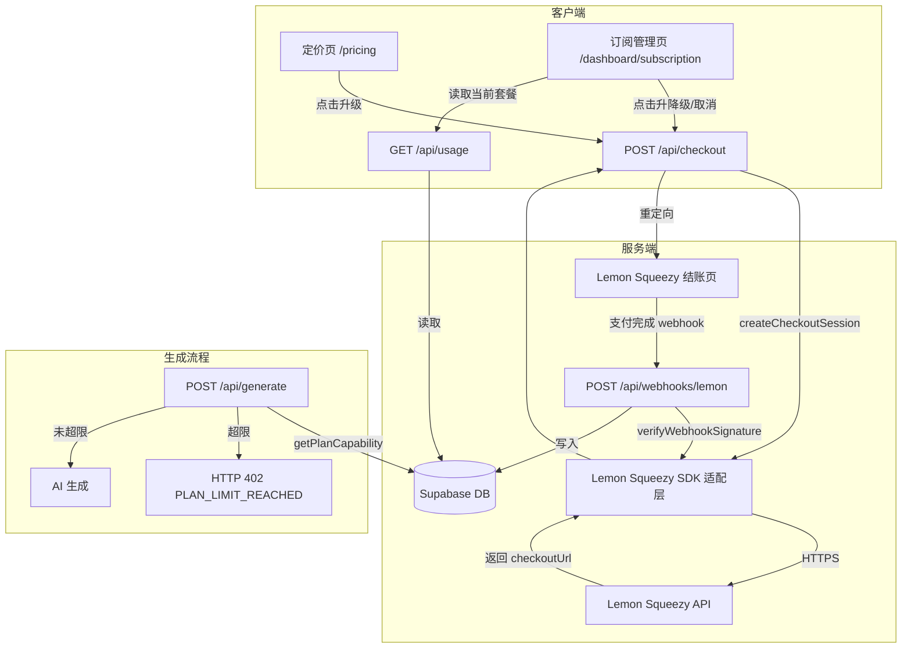

# 技术设计文档：支付与商业化（Phase 4）

## 概述

本阶段为 AutoContent Pro v1.0 引入完整的支付与商业化能力，包括：

- **定价页**（`/pricing`）：公开展示四档套餐对比，支持一键发起结账
- **Checkout API**（`POST /api/checkout`）：创建 Lemon Squeezy 结账会话
- **Webhook 处理器**（`POST /api/webhooks/lemon`）：接收并处理订阅生命周期事件，以 webhook 为权威来源同步数据库状态
- **订阅管理页**（`/dashboard/subscription`）：展示当前套餐，提供升降级/取消入口
- **套餐能力执行**：在 `POST /api/generate` 路由中调用已有的 `getPlanCapability` 服务，强制执行平台数量和月度生成次数限制

本阶段依赖 Phase 3 已有的 `getPlanCapability`、`plans`/`subscriptions`/`webhook_events` 表结构、`current_active_subscriptions` 视图及 RLS 策略，不对其进行重新设计。

---

## 架构

### 整体数据流



### 关键设计决策

1. **Webhook 为权威来源**：订阅状态仅由 webhook 事件驱动写入，前端回调 URL 仅用于 UI 提示，不触发状态变更。
2. **原始字节流签名验证**：Webhook 处理器必须在 `JSON.parse` 之前以原始 `Buffer` 验证 HMAC-SHA256 签名，防止 JSON 规范化攻击。
3. **幂等性通过数据库约束保证**：`webhook_events(provider, event_id)` 唯一约束是幂等性的唯一保障，不依赖内存缓存或分布式锁。
4. **SDK 适配层隔离**：所有 Lemon Squeezy SDK 调用封装在 `src/lib/billing/lemon-squeezy.ts`，路由层不直接引用 SDK，便于测试和替换。
5. **套餐数据从数据库读取**：定价页套餐数据通过服务端组件从 `plans` 表读取，不硬编码，保证与数据库一致。

---

## 组件与接口

### 1. Lemon Squeezy SDK 适配层（`src/lib/billing/lemon-squeezy.ts`）

仅在服务端初始化，暴露两个核心函数：

```typescript
// 创建结账会话，返回 checkoutUrl
export async function createCheckoutSession(
  variantId: string,
  userId: string,
  successUrl: string,
  cancelUrl: string,
): Promise<string>

// 验证 webhook 签名（原始字节流）
export function verifyWebhookSignature(
  rawBody: Buffer,
  signature: string,
  secret: string,
): boolean
```

**初始化约束**：`LEMONSQUEEZY_API_KEY` 仅在模块顶层服务端初始化，绝不导出给客户端组件。

### 2. Checkout API（`src/app/api/checkout/route.ts`）

```
POST /api/checkout
Authorization: 需要有效 session（getSession()）
Content-Type: application/json

请求体（Zod 校验）：
{
  planCode: "creator" | "studio" | "enterprise",
  successUrl: string (URL),
  cancelUrl: string (URL)
}

成功响应 200：
ApiSuccess<{ checkoutUrl: string; provider: "lemonsqueezy" }>

错误响应：
- 400 INVALID_INPUT：planCode 无效、缺失或为 "free"
- 401 UNAUTHORIZED：无有效 session
- 503 SERVICE_UNAVAILABLE：Lemon Squeezy SDK 调用失败
```

Plan_Code → Variant_ID 映射通过环境变量：
```
LEMON_VARIANT_CREATOR  → "creator"
LEMON_VARIANT_STUDIO   → "studio"
LEMON_VARIANT_ENTERPRISE → "enterprise"
```

### 3. Webhook 处理器（`src/app/api/webhooks/lemon/route.ts`）

```
POST /api/webhooks/lemon
Authorization: 无 session，仅 x-signature 头验证

处理流程：
1. 以 req.arrayBuffer() 读取原始字节流
2. verifyWebhookSignature(rawBody, x-signature, LEMONSQUEEZY_WEBHOOK_SECRET)
3. 若签名无效 → 401 WEBHOOK_SIGNATURE_INVALID
4. JSON.parse(rawBody) 解析事件
5. 尝试插入 webhook_events(provider, event_id)
   - 若唯一约束冲突 → 200 { processed: true }（幂等）
6. 根据 event_type 执行订阅状态变更
7. 返回 200 { processed: true }
```

事件类型映射：

| event_type              | subscriptions 操作                          |
|-------------------------|---------------------------------------------|
| `order_created`         | 仅记录 webhook_events，不修改 subscriptions |
| `subscription_created`  | upsert，status = `active`                   |
| `subscription_updated`  | update 匹配行（不允许 expired → active）    |
| `subscription_cancelled`| update status = `cancelled`，记录 cancelled_at |
| `subscription_expired`  | update status = `expired`                   |

### 4. 定价页（`src/app/(marketing)/pricing/page.tsx`）

服务端组件，从 `plans` 表读取套餐数据。客户端子组件 `PricingCard` 处理 CTA 交互：

- 已登录用户：调用 `POST /api/checkout`，获得 `checkoutUrl` 后 `window.location.href` 跳转
- 未登录用户：`router.push('/login')`
- 当前套餐高亮：通过 `GET /api/usage` 获取 `plan.code` 后标记

### 5. 订阅管理页（`src/app/dashboard/subscription/page.tsx`）

需登录（middleware 已保护 `/dashboard/*`）。通过 `GET /api/usage` 获取当前套餐和订阅状态，根据状态条件渲染：

| Subscription_Status     | 展示内容                                    |
|-------------------------|---------------------------------------------|
| `active` / `trialing`   | 升降级选项 + 取消入口                       |
| `cancelled` / `expired` | 重新订阅 CTA（链接到 /pricing）             |
| `past_due` / `paused`   | 提示信息 + 联系支持                         |

### 6. 套餐能力执行（`src/app/api/generate/route.ts` 修改）

在现有 `POST /api/generate` 路由中，Zod 校验通过后、调用 AI 服务前，插入能力检查：

```typescript
// 仅对已登录用户执行套餐能力检查
if (userId) {
  let capability: PlanCapability;
  try {
    capability = await getPlanCapability(userId);
  } catch {
    return NextResponse.json(
      createError(ERROR_CODES.SERVICE_UNAVAILABLE, '无法获取套餐信息', requestId),
      { status: 503 }
    );
  }

  // 平台数量限制
  if (capability.maxPlatforms !== null && platforms.length > capability.maxPlatforms) {
    return NextResponse.json(
      createError(ERROR_CODES.PLAN_LIMIT_REACHED, '已超出套餐平台数量限制', requestId),
      { status: 402 }
    );
  }

  // 月度生成次数限制（从 usage_stats 读取当月计数）
  if (capability.monthlyGenerationLimit !== null) {
    const currentCount = await getMonthlyGenerationCount(userId);
    if (currentCount >= capability.monthlyGenerationLimit) {
      return NextResponse.json(
        createError(ERROR_CODES.PLAN_LIMIT_REACHED, '已达到本月生成次数上限', requestId),
        { status: 402 }
      );
    }
  }
}
```

---

## 数据模型

### 已有表结构（Phase 3，不修改）

```sql
-- plans 表
plans (
  id uuid PK,
  code text UNIQUE,           -- 'free' | 'creator' | 'studio' | 'enterprise'
  display_name text,
  platform_limit int | null,
  monthly_generation_limit int | null,
  has_history bool,
  has_api_access bool,
  has_team_access bool,
  speed_tier text,
  price_monthly_cents int,
  created_at timestamptz
)

-- subscriptions 表
subscriptions (
  id uuid PK,
  user_id uuid FK → auth.users,
  plan_id uuid FK → plans,
  provider text,              -- 'lemonsqueezy'
  provider_subscription_id text,
  status text CHECK IN ('active','cancelled','expired','past_due','trialing','paused'),
  current_period_start timestamptz,
  current_period_end timestamptz,
  cancelled_at timestamptz | null,
  created_at timestamptz,
  updated_at timestamptz
)

-- webhook_events 表
webhook_events (
  id uuid PK,
  provider text,
  event_id text,
  event_type text,
  payload jsonb,
  processed_at timestamptz,
  UNIQUE(provider, event_id)  -- 幂等性约束
)

-- current_active_subscriptions 视图
-- 返回每个 user_id 最新的 active/trialing 订阅行
```

### 新增类型（`src/types/index.ts` 扩展）

```typescript
// 结账 API 响应数据
export interface CheckoutResponseData {
  checkoutUrl: string;
  provider: 'lemonsqueezy';
}

// 订阅状态
export type SubscriptionStatus =
  | 'active' | 'cancelled' | 'expired'
  | 'past_due' | 'trialing' | 'paused';

// 定价页套餐展示数据
export interface PricingPlan {
  code: string;
  displayName: string;
  priceMonthly: number;        // 分，0 = 免费
  monthlyGenerationLimit: number | null;
  platformLimit: number | null;
  speedTier: string;
}
```

---

## 正确性属性

*属性（Property）是在系统所有合法执行路径上都应成立的特征或行为——本质上是对系统应做什么的形式化陈述。属性是人类可读规范与机器可验证正确性保证之间的桥梁。*

### 属性 1：Webhook 幂等性

*对于任意*合法 webhook 载荷和 event_id，使用相同载荷调用 Webhook_Handler 两次，`webhook_events` 表中应恰好存在一行对应记录，`subscriptions` 表中应至多发生一次状态变更；第二次调用必须返回 HTTP 200 `{ processed: true }`。

**验证需求：3.3**

---

### 属性 2：签名验证可靠性

*对于任意*合法的 `(payload, secret)` 对，对载荷或签名的任意字节修改都必须导致 `verifyWebhookSignature` 返回 `false`；Webhook_Handler 对任何 `verifyWebhookSignature` 返回 `false` 的请求必须返回 HTTP 401 `WEBHOOK_SIGNATURE_INVALID`。

**验证需求：3.1、3.2**

---

### 属性 3：订阅状态机合法性

*对于任意* webhook 事件类型，写入 `subscriptions` 表的 `status` 值必须是集合 `{ active, cancelled, expired, past_due, trialing, paused }` 的成员；`subscription_updated` 事件不得将状态从 `expired` 变更为 `active`；对已处于终态（`cancelled`/`expired`）的订阅重复发送同类终态事件，必须作为无操作处理并返回 HTTP 200。

**验证需求：4.1、4.2、4.3、4.4**

---

### 属性 4：套餐能力执行完整性

*对于任意*已登录用户，若其 `monthlyGenerationCount >= monthlyGenerationLimit`（限制非 null），Generate_Route 必须返回 HTTP 402 `PLAN_LIMIT_REACHED`；若其 `selectedPlatforms.length > maxPlatforms`（限制非 null），同样返回 HTTP 402 `PLAN_LIMIT_REACHED`；若相关限制为 `null`（无限制套餐），Generate_Route 不得在该维度返回 `PLAN_LIMIT_REACHED`。

**验证需求：6.2、6.3、6.4、6.5**

---

### 属性 5：Checkout 认证门控

*对于任意*未携带有效 session 的请求，Checkout_API 必须返回 HTTP 401；*对于任意* `planCode` 为 `"free"` 或不可识别值的请求，必须返回 HTTP 400；*对于任意*携带有效 session 且 `planCode` 为合法付费套餐的请求，响应必须包含非空的 `checkoutUrl`。

**验证需求：2.1、2.2、2.3、2.4**

---

### 属性 6：API 响应信封完整性

*对于任意* Checkout_API 请求（无论成功或失败），响应体必须符合 `ApiSuccess<T>` 或 `ApiError` 信封格式，且包含非空的 `requestId` 和合法的 ISO 8601 `timestamp`。

**验证需求：2.8**

---

## 错误处理

### 错误码扩展

在 `src/lib/errors/index.ts` 中新增：

```typescript
WEBHOOK_SIGNATURE_INVALID: 'WEBHOOK_SIGNATURE_INVALID',  // 401
```

对应 HTTP 状态映射：`WEBHOOK_SIGNATURE_INVALID: 401`

### 各层错误处理策略

| 层级 | 错误场景 | 处理方式 |
|------|----------|----------|
| Checkout API | Zod 校验失败 | 400 INVALID_INPUT |
| Checkout API | planCode = "free" | 400 INVALID_INPUT |
| Checkout API | 无 session | 401 UNAUTHORIZED |
| Checkout API | SDK 调用失败 | 503 SERVICE_UNAVAILABLE |
| Webhook Handler | 签名无效/缺失 | 401 WEBHOOK_SIGNATURE_INVALID，不记录事件 |
| Webhook Handler | 重复 event_id | 200 { processed: true }，不重复处理 |
| Webhook Handler | DB 写入失败 | 500 INTERNAL_ERROR |
| Generate Route | getPlanCapability 抛出 | 503 SERVICE_UNAVAILABLE |
| Generate Route | 超出套餐限制 | 402 PLAN_LIMIT_REACHED |
| 定价页 / 订阅管理页 | Checkout API 返回错误 | 内联错误提示，不跳转 |

### Webhook 签名验证实现要点

```typescript
// 必须在 JSON.parse 之前以原始字节流验证
const rawBody = Buffer.from(await req.arrayBuffer());
const signature = req.headers.get('x-signature') ?? '';
const isValid = verifyWebhookSignature(rawBody, signature, process.env.LEMONSQUEEZY_WEBHOOK_SECRET!);
if (!isValid) {
  return NextResponse.json(
    createError('WEBHOOK_SIGNATURE_INVALID', '签名验证失败', requestId),
    { status: 401 }
  );
}
// 仅在签名验证通过后才 JSON.parse
const event = JSON.parse(rawBody.toString('utf-8'));
```

---

## 测试策略

### 双轨测试方法

本阶段采用单元测试与属性测试相结合的方式：

- **单元测试**：验证具体示例、边界条件和错误场景
- **属性测试**：验证跨所有输入的普遍性属性

两者互补，共同保证正确性。

### 属性测试配置

- 属性测试库：**fast-check**（TypeScript 生态，与 Vitest 集成）
- 每个属性测试最少运行 **100 次迭代**
- 每个属性测试必须通过注释引用设计文档中的属性编号
- 标签格式：`// Feature: payments-monetization, Property {N}: {property_text}`

### 属性测试（Property-Based Tests）

每个正确性属性对应一个属性测试：

**属性 1：Webhook 幂等性**
```
// Feature: payments-monetization, Property 1: Webhook 幂等性
// 生成随机合法 webhook 载荷，发送两次，验证 webhook_events 仅一行，
// 第二次响应为 200 { processed: true }
```

**属性 2：签名验证可靠性**
```
// Feature: payments-monetization, Property 2: 签名验证可靠性
// 生成随机 (payload, secret) 对，对任意字节位置的修改，
// 验证 verifyWebhookSignature 返回 false
```

**属性 3：订阅状态机合法性**
```
// Feature: payments-monetization, Property 3: 订阅状态机合法性
// 生成随机事件类型和订阅状态，验证写入的 status 始终在允许集合内，
// 验证 expired → active 转换被阻止
```

**属性 4：套餐能力执行完整性**
```
// Feature: payments-monetization, Property 4: 套餐能力执行完整性
// 生成随机用户套餐限制和请求参数，验证超限时返回 402，
// null 限制时不返回 402
```

**属性 5：Checkout 认证门控**
```
// Feature: payments-monetization, Property 5: Checkout 认证门控
// 生成随机 planCode 和 session 状态，验证认证和输入校验的正确性
```

**属性 6：API 响应信封完整性**
```
// Feature: payments-monetization, Property 6: API 响应信封完整性
// 对所有 Checkout API 请求，验证响应体包含 requestId 和合法 timestamp
```

### 单元测试（Unit Tests）

聚焦具体示例和边界条件，避免与属性测试重复：

- `verifyWebhookSignature`：已知合法签名返回 true，空签名返回 false
- Checkout API：`planCode: "free"` 返回 400，SDK 失败返回 503
- Webhook Handler：`order_created` 事件不修改 subscriptions 表
- Webhook Handler：DB 写入失败返回 500
- Webhook Handler：无 session 的合法签名请求正常处理（不依赖 session）
- 订阅管理页：URL 查询参数不影响展示的订阅状态
- Generate Route：匿名用户不触发 getPlanCapability 调用

### 测试文件结构

```
tests/
  unit/
    billing/
      lemon-squeezy.test.ts       # SDK 适配层单元测试
      plan-capability.test.ts     # 已有，不修改
  integration/
    payments-monetization/
      vitest.config.ts
      helpers.ts
      properties/
        p1-webhook-idempotency.test.ts
        p2-signature-verification.test.ts
        p3-subscription-state-machine.test.ts
        p4-plan-capability-enforcement.test.ts
        p5-checkout-auth-gate.test.ts
        p6-api-response-envelope.test.ts
```
