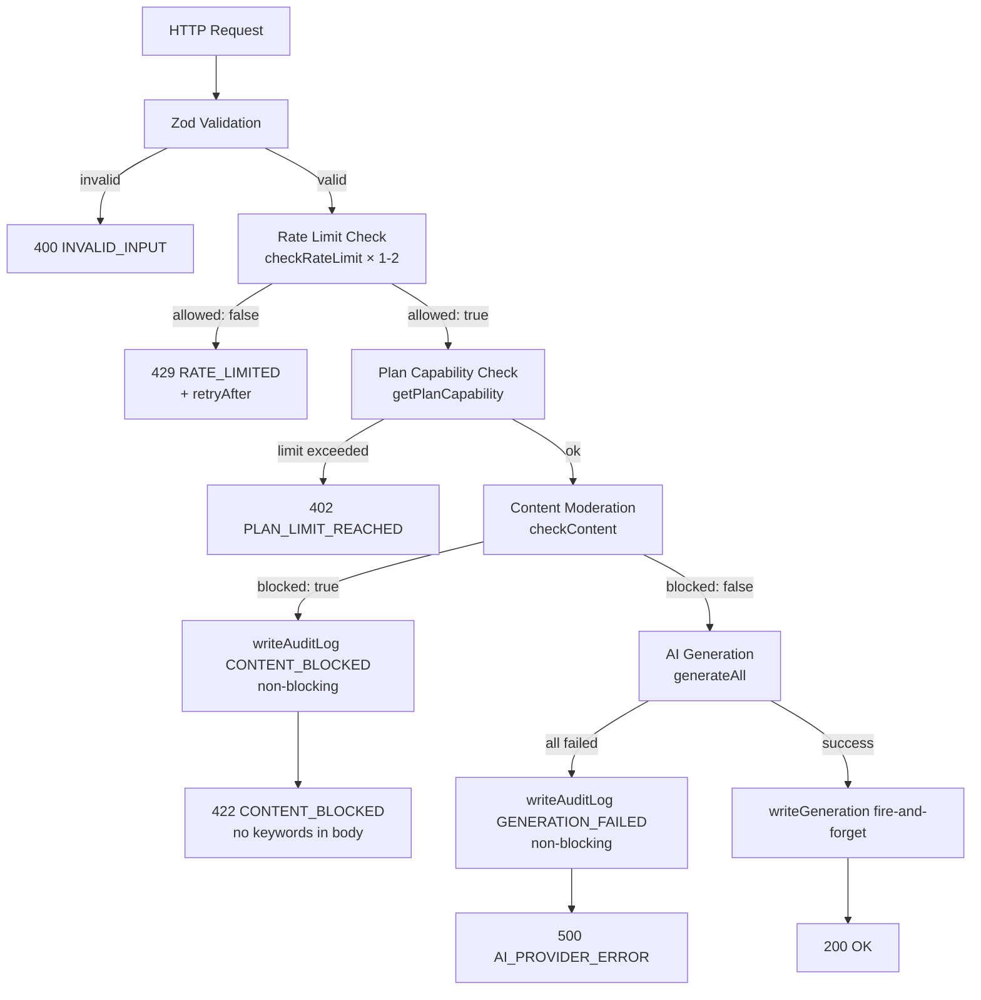
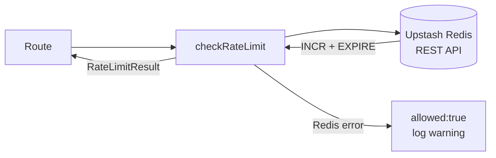
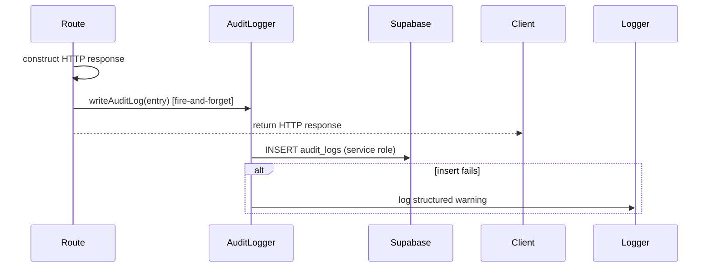

# Design Document

## Feature: Risk Control and Launch Readiness (v1.0 Phase 5)

---

## Overview

本阶段在已有 MVP 安全基础上，为 AutoContent Pro v1.0 生产上线提供最后一层防护。核心工作分为五个方向：

1. **双维度限流**：将 Phase 1 的纯 IP 限流升级为 IP + 用户 ID 双维度策略，并按匿名/免费/付费三档差异化配置，覆盖 `/api/generate` 和 `/api/extract` 路由。
2. **审计日志**：新增 `audit-logger.ts` 模块，以非阻塞方式将登录、支付、订阅、内容拦截、关键失败等事件写入 `audit_logs` 表。
3. **内容审核增强**：重构 `moderation` 模块，使其返回结构化结果，关键词仅用于内部日志，不暴露给客户端。
4. **集成测试**：为 generate、history、usage、webhook 路由补充 Vitest 集成测试。
5. **E2E 测试**：用 Playwright 覆盖登录、生成、历史、支付发起四条核心路径。

所有新增代码严格遵循现有目录规范（`src/lib/`、`tests/`）和 TypeScript strict 模式。

---

## Architecture

### 请求处理管道（POST /api/generate）



### 限流模块架构



### 审计日志写入流程



---

## Components and Interfaces

### 1. Rate Limiter — `src/lib/rate-limit/index.ts`

```typescript
export interface RateLimitResult {
  allowed: boolean;
  remaining: number; // -1 if Redis unavailable
  resetAt: number;   // Unix timestamp; -1 if Redis unavailable
}

/**
 * Increments the counter for `key` in Upstash Redis.
 * Uses INCR + EXPIRE pattern within a pipeline.
 * Key format: rl:{scope}:{identifier}:{windowLabel}
 */
export async function checkRateLimit(
  key: string,
  limit: number,
  windowSeconds: number,
): Promise<RateLimitResult>
```

**Redis 操作**：使用 Upstash `@upstash/redis` 的 pipeline，原子执行 `INCR key` + `EXPIRE key windowSeconds`（仅首次设置 TTL）。实际使用 `SET key 0 EX windowSeconds NX` + `INCR key` 两步 pipeline 保证原子性和 TTL 正确性。

**Key 构造辅助函数**（内部使用）：

```typescript
function buildRateLimitKey(
  scope: 'generate' | 'extract',
  dimension: 'ip' | 'user',
  identifier: string,
  windowLabel: '1h',
): string  // => "rl:{scope}:{dimension}:{identifier}:{windowLabel}"
```

**降级策略**：若 Redis 请求抛出异常，捕获后返回 `{ allowed: true, remaining: -1, resetAt: -1 }`，并通过 `logger.warn` 记录，不阻塞请求。

---

### 2. Generate 路由限流策略 — `src/app/api/generate/route.ts`（增强）

在 Zod 验证通过后、plan capability 检查前插入限流逻辑：

| 用户类型 | 主维度 | 主限额 | 副维度 | 副限额 |
|---------|--------|--------|--------|--------|
| 匿名 | IP | 5 req/h | — | — |
| 免费 | userId | 20 req/h | IP | 10 req/h |
| 付费 | userId | 100 req/h | IP | 30 req/h |

用户类型判断：
- 无 session → 匿名
- session 存在 → 调用 `getPlanCapability`，`planCode === 'free'` → 免费，否则 → 付费

限流失败时响应：
```json
{
  "success": false,
  "error": {
    "code": "RATE_LIMITED",
    "message": "请求过于频繁，请稍后再试",
    "details": { "retryAfter": 1720000000 }
  }
}
```

---

### 3. Extract 路由限流策略 — `src/app/api/extract/route.ts`（增强）

| 用户类型 | 维度 | 限额 |
|---------|------|------|
| 匿名 | IP | 3 req/h |
| 免费 | userId | 10 req/h |
| 付费 | userId | 30 req/h |

逻辑与 generate 路由相同，仅 scope 改为 `'extract'`，限额不同。

---

### 4. Audit Logger — `src/lib/db/audit-logger.ts`

```typescript
export interface AuditLogEntry {
  action: AuditAction;
  userId?: string | null;
  ipAddress?: string | null;
  userAgent?: string | null;
  resourceType?: string | null;
  resourceId?: string | null;
  metadata?: Record<string, unknown>;
}

export type AuditAction =
  | 'USER_SIGN_IN'
  | 'USER_SIGN_IN_FAILED'
  | 'SUBSCRIPTION_CREATED'
  | 'SUBSCRIPTION_CANCELLED'
  | 'SUBSCRIPTION_UPDATED'
  | 'ORDER_CREATED'
  | 'GENERATION_FAILED'
  | 'WEBHOOK_SIGNATURE_INVALID'
  | 'CHECKOUT_FAILED'
  | 'CONTENT_BLOCKED';

/**
 * Writes one row to audit_logs using the service role client.
 * Never throws — all errors are caught and logged as warnings.
 */
export async function writeAuditLog(entry: AuditLogEntry): Promise<void>
```

**非阻塞保证**：`writeAuditLog` 内部用 `try/catch` 包裹所有 Supabase 操作。调用方使用 `void writeAuditLog(...)` 或 `writeAuditLog(...).catch(() => {})` 模式，不 `await`，确保审计失败不影响 HTTP 响应。

**调用点汇总**：

| 调用位置 | action | 时机 |
|---------|--------|------|
| `src/app/auth/callback/route.ts` | `USER_SIGN_IN` | 成功回调后 |
| `src/components/auth/LoginForm.tsx` → server action | `USER_SIGN_IN_FAILED` | 登录失败后 |
| `src/app/api/webhooks/lemon/route.ts` | `SUBSCRIPTION_CREATED/CANCELLED/UPDATED/ORDER_CREATED` | 事件处理成功后 |
| `src/app/api/webhooks/lemon/route.ts` | `WEBHOOK_SIGNATURE_INVALID` | 签名验证失败后 |
| `src/app/api/generate/route.ts` | `GENERATION_FAILED` | 500 响应构造后 |
| `src/app/api/generate/route.ts` | `CONTENT_BLOCKED` | 422 响应构造后 |
| `src/app/api/checkout/route.ts` | `CHECKOUT_FAILED` | 503 响应构造后 |

---

### 5. Content Moderation — `src/lib/moderation/index.ts`（增强）

```typescript
export interface ModerationResult {
  blocked: boolean;
  reason?: 'KEYWORD_MATCH';
  matchedKeywords?: string[]; // 仅用于内部日志，不返回客户端
}

export function checkContent(content: string): ModerationResult
```

关键词列表独立维护于 `src/lib/moderation/keywords.ts`：

```typescript
// 关键词列表保密 — 不在响应体或 audit_logs 中暴露
export const BLOCKED_KEYWORDS: readonly string[] = [
  // ... 敏感词列表
]
```

**Generate 路由调用方式**：
```typescript
const modResult = checkContent(content);
if (modResult.blocked) {
  void writeAuditLog({
    action: 'CONTENT_BLOCKED',
    userId,
    metadata: {
      requestId,
      reason: modResult.reason,
      keywordCount: modResult.matchedKeywords?.length ?? 0,
      // matchedKeywords 不写入
    },
  });
  return NextResponse.json(
    createError(ERROR_CODES.CONTENT_BLOCKED, '内容包含不允许的词汇', requestId),
    // 响应体不含 matchedKeywords
  );
}
```

---

## Data Models

### RateLimitResult

```typescript
interface RateLimitResult {
  allowed: boolean;
  remaining: number; // 剩余请求数；-1 表示 Redis 不可用
  resetAt: number;   // 窗口重置的 Unix 时间戳；-1 表示 Redis 不可用
}
```

### AuditLogEntry（对应 audit_logs 表）

| 字段 | 类型 | 说明 |
|------|------|------|
| `action` | `AuditAction` | 事件类型，UPPER_SNAKE_CASE |
| `userId` | `string \| null` | Supabase auth user UUID |
| `ipAddress` | `string \| null` | 请求 IP |
| `userAgent` | `string \| null` | 请求 User-Agent |
| `resourceType` | `string \| null` | 关联资源类型（如 `'subscription'`） |
| `resourceId` | `string \| null` | 关联资源 ID |
| `metadata` | `Record<string, unknown>` | 事件附加数据（JSON） |

`audit_logs` 表结构由 Phase 2（`supabase-infrastructure`）定义，本阶段仅写入。

### ModerationResult

```typescript
interface ModerationResult {
  blocked: boolean;
  reason?: 'KEYWORD_MATCH';
  matchedKeywords?: string[]; // 内部使用，不序列化到任何外部输出
}
```

---

## Correctness Properties

*A property is a characteristic or behavior that should hold true across all valid executions of a system — essentially, a formal statement about what the system should do. Properties serve as the bridge between human-readable specifications and machine-verifiable correctness guarantees.*

### Property 1: Rate Limit Counter Monotonicity

*For any* rate limit key, limit N, and window duration, after K successive calls to `checkRateLimit` where K ≤ N, `remaining` must equal `N - K` and `allowed` must be `true`; after any call where K > N, `allowed` must be `false` and `remaining` must be `0`.

**Validates: Requirements 1.3, 1.4**

### Property 2: Rate Limit Key Format Invariant

*For any* combination of scope (`generate` | `extract`), dimension (`ip` | `user`), identifier string, and window label, the constructed Redis key must match the pattern `rl:{scope}:{dimension}:{identifier}:{windowLabel}` and must not contain any other separators or characters that could cause key collisions.

**Validates: Requirements 1.7**

### Property 3: Rate-Limited Requests Return 429 with retryAfter

*For any* API route that enforces rate limiting, when the rate limit is exhausted, the HTTP response must have status 429, error code `RATE_LIMITED`, and the `details` object must contain a `retryAfter` field with a positive Unix timestamp equal to `resetAt` from `RateLimitResult`.

**Validates: Requirements 2.4, 2.6, 3.4**

### Property 4: Audit Log Non-Blocking

*For any* code path that calls `writeAuditLog`, if the Supabase insert throws or rejects, the originating HTTP response must have the same status code and body it would have had without the audit log call — audit failures must be invisible to the caller.

**Validates: Requirements 4.4, 5.5, 6.4**

### Property 5: Moderation Keyword Confidentiality in HTTP Response

*For any* request where `checkContent` returns `{ blocked: true, matchedKeywords: [...] }`, the HTTP 422 response body must not contain any string from `matchedKeywords` — neither in the `error.message`, `error.details`, nor any other field.

**Validates: Requirements 7.2, 7.3**

### Property 6: Audit Log Keyword Confidentiality

*For any* request blocked by content moderation, the `CONTENT_BLOCKED` row inserted into `audit_logs` must contain `keywordCount` (a number) in `metadata` but must not contain the actual keyword strings from `matchedKeywords` anywhere in the row.

**Validates: Requirements 7.5**

---

## Error Handling

### 限流错误

- Redis 连接失败 → 降级放行，`logger.warn` 记录，不影响请求
- 限流触发 → HTTP 429，`RATE_LIMITED`，`details.retryAfter` 为重置时间戳

### 审计日志错误

- Supabase 写入失败 → `logger.warn` 记录，不抛出，不影响调用方响应
- 调用方始终使用 `void writeAuditLog(...)` 模式

### 内容审核错误

- `checkContent` 是纯同步函数，不涉及 I/O，不会抛出
- 关键词列表为编译时常量，不存在运行时加载失败

### 集成测试环境错误

- 测试前通过 `helpers.ts` 重置 Redis 限流 key（`DEL rl:*`）
- 测试后通过 `deleteTestUser` 清理 Supabase 测试用户

---

## Testing Strategy

### 双轨测试方法

本阶段采用**集成测试（Vitest）+ E2E 测试（Playwright）**双轨策略：

- **集成测试**：针对 API 路由，使用真实本地 Supabase 和真实 Upstash Redis（或本地 Redis mock），验证限流、审计、审核的端到端行为
- **E2E 测试**：使用 Playwright 在真实浏览器中验证核心用户路径

### 集成测试结构

```
tests/integration/risk-control-launch-readiness/
  vitest.config.ts
  helpers.ts              # 用户创建/清理、Redis key 重置、webhook 签名
  generate.test.ts        # Requirement 8
  history.test.ts         # Requirement 9
  webhook.test.ts         # Requirement 10
```

**vitest.config.ts** 继承现有模式，额外注入：
```typescript
env: {
  UPSTASH_REDIS_REST_URL:   env.UPSTASH_REDIS_REST_URL   || '',
  UPSTASH_REDIS_REST_TOKEN: env.UPSTASH_REDIS_REST_TOKEN || '',
  NEXT_PUBLIC_APP_URL:      env.NEXT_PUBLIC_APP_URL      || 'http://localhost:3000',
}
```

**helpers.ts** 新增能力：
- `resetRateLimitKeys(scope: string)` — 通过 Upstash REST API 删除 `rl:{scope}:*` 模式的 key
- `setUserPlan(userId, planCode)` — 直接写 subscriptions 表设置测试用户套餐
- 复用 `payments-monetization/helpers.ts` 中的 `createTestUser`、`deleteTestUser`、`signWebhookPayload`

**generate.test.ts** 覆盖场景（Requirement 8）：
1. 免费用户有效请求 → 200，含 `generationId` 和 `results`
2. 匿名 IP 超限 → 429，`RATE_LIMITED`
3. 内容含屏蔽词 → 422，`CONTENT_BLOCKED`
4. 免费用户超平台数 → 402，`PLAN_LIMIT_REACHED`
5. 无效平台代码 → 400，`INVALID_PLATFORM`

**history.test.ts** 覆盖场景（Requirement 9）：
1. 未认证请求 history → 401，`UNAUTHORIZED`
2. 用户 A 只能看到自己的记录（用户 B 的记录不出现）
3. 响应 items 不含 `input_content` 或 `result_json`
4. usage 返回正确 `monthlyGenerationCount`
5. 未认证请求 usage → 401，`UNAUTHORIZED`

**webhook.test.ts** 覆盖场景（Requirement 10）：
1. 无效签名 → 401，`WEBHOOK_SIGNATURE_INVALID`
2. 有效 `subscription_created` → subscriptions 表有 `status: active` 行
3. 同一 event_id 发送两次 → webhook_events 只有一行，第二次返回 `{ processed: true }`
4. 有效 `subscription_cancelled` → status 变为 `cancelled`，`cancelled_at` 有值
5. 成功处理 `subscription_created` 后 → audit_logs 有 `SUBSCRIPTION_CREATED` 行

### 属性测试（Property-Based Tests）

使用 `fast-check` 库，每个属性测试最少运行 **100 次**迭代。

```
tests/integration/risk-control-launch-readiness/properties/
  p1-rate-limit-monotonicity.test.ts
  p2-rate-limit-key-format.test.ts
  p3-rate-limited-429.test.ts
  p4-audit-log-non-blocking.test.ts
  p5-keyword-confidentiality-http.test.ts
  p6-keyword-confidentiality-audit.test.ts
```

每个属性测试文件头部注释格式：
```typescript
// Feature: risk-control-launch-readiness, Property 1: Rate Limit Counter Monotonicity
```

**P1 实现思路**：用 `fc.integer({ min: 1, max: 50 })` 生成随机 limit N，调用 `checkRateLimit` N 次，验证每次 `remaining` 递减；第 N+1 次验证 `allowed: false`。

**P2 实现思路**：用 `fc.string()` 生成随机 identifier，验证 `buildRateLimitKey` 输出匹配正则 `/^rl:[a-z]+:[a-z]+:.+:[0-9]+[smhd]$/`。

**P3 实现思路**：用 `fc.record(...)` 生成随机请求体，先耗尽限额，再发请求，验证 429 响应体含 `retryAfter`。

**P4 实现思路**：注入一个总是 reject 的 mock Supabase client，调用 `writeAuditLog`，验证函数 resolve（不 reject），且不抛出。

**P5 实现思路**：用 `fc.string()` 生成随机关键词，构造含该关键词的内容，调用 generate 路由，验证 422 响应体的 JSON 序列化字符串不包含该关键词。

**P6 实现思路**：同 P5，但验证 `audit_logs` 中 `CONTENT_BLOCKED` 行的 `metadata` 不含关键词字符串，只含 `keywordCount`。

### E2E 测试结构

```
tests/e2e/
  auth.spec.ts      # Requirement 11
  generate.spec.ts  # Requirement 12
  history.spec.ts   # Requirement 13
  payment.spec.ts   # Requirement 13
playwright.config.ts
```

**playwright.config.ts** 配置要点：
- `baseURL`: `process.env.PLAYWRIGHT_BASE_URL || 'http://localhost:3000'`
- `testDir`: `'./tests/e2e'`
- `use.trace`: `'on-first-retry'`
- 使用 `storageState` 保存认证状态，避免每个测试重复登录

**auth.spec.ts** 场景（Requirement 11）：
1. 导航到 `/login` → 输入有效凭据 → 重定向到 `/dashboard`
2. 输入无效凭据 → 停留在 `/login`，显示错误消息
3. 登录成功后 dashboard 显示套餐名称

**generate.spec.ts** 场景（Requirement 12）：
1. 匿名用户粘贴内容 → 选择平台 → 点击生成 → 看到非空结果卡片
2. 点击复制按钮 → 触发剪贴板写入或显示成功指示
3. 空内容提交 → 显示验证错误，不调用 API
4. API 返回 `RATE_LIMITED` → UI 显示用户友好错误消息

**history.spec.ts** 场景（Requirement 13）：
1. 认证用户完成生成 → 在 `/dashboard/history` 看到该记录
2. 未认证用户访问 `/dashboard/history` → 重定向到 `/login`

**payment.spec.ts** 场景（Requirement 13）：
1. 认证用户在 `/pricing` 点击升级 CTA → 重定向到 Lemon Squeezy checkout URL
2. 未认证用户点击升级 CTA → 重定向到 `/login`

---

## v1.0 Launch Acceptance Checklist

以下所有检查项必须全部通过，方可批准 v1.0 生产部署。

### 环境变量

- [ ] `UPSTASH_REDIS_REST_URL` 已在生产环境配置
- [ ] `UPSTASH_REDIS_REST_TOKEN` 已在生产环境配置
- [ ] `DASHSCOPE_API_KEY` 已在生产环境配置
- [ ] `SUPABASE_URL` 已在生产环境配置
- [ ] `SUPABASE_ANON_KEY` 已在生产环境配置
- [ ] `SUPABASE_SERVICE_ROLE_KEY` 已在生产环境配置
- [ ] `LEMONSQUEEZY_API_KEY` 已在生产环境配置
- [ ] `LEMONSQUEEZY_WEBHOOK_SECRET` 已在生产环境配置
- [ ] `LEMON_VARIANT_CREATOR` 已在生产环境配置
- [ ] `LEMON_VARIANT_STUDIO` 已在生产环境配置
- [ ] `LEMON_VARIANT_ENTERPRISE` 已在生产环境配置

### 限流

- [ ] 匿名用户超过 5 次/小时后，`/api/generate` 返回 HTTP 429（staging 验证）
- [ ] 免费用户超过 20 次/小时后，`/api/generate` 返回 HTTP 429（staging 验证）
- [ ] 429 响应体包含 `details.retryAfter` 字段
- [ ] Redis 连接失败时请求正常放行（降级验证）

### 审计日志

- [ ] staging 环境登录事件在 `audit_logs` 中产生 `USER_SIGN_IN` 行
- [ ] staging 环境支付 webhook 在 `audit_logs` 中产生 `SUBSCRIPTION_CREATED` 行
- [ ] 内容被拦截时 `audit_logs` 中产生 `CONTENT_BLOCKED` 行，且不含关键词
- [ ] 审计日志写入失败不影响正常 HTTP 响应（注入失败测试验证）

### 内容审核

- [ ] 含屏蔽词的请求返回 HTTP 422，`CONTENT_BLOCKED`
- [ ] 422 响应体不含任何屏蔽关键词
- [ ] 关键词列表存储在 `src/lib/moderation/keywords.ts`，不硬编码在路由中

### 集成测试

- [ ] `tests/integration/risk-control-launch-readiness/generate.test.ts` 全部通过（staging）
- [ ] `tests/integration/risk-control-launch-readiness/history.test.ts` 全部通过（staging）
- [ ] `tests/integration/risk-control-launch-readiness/webhook.test.ts` 全部通过（staging）
- [ ] 所有 P1–P6 属性测试（100 次迭代）全部通过

### E2E 测试

- [ ] `tests/e2e/auth.spec.ts` 全部通过（staging 部署）
- [ ] `tests/e2e/generate.spec.ts` 全部通过（staging 部署）
- [ ] `tests/e2e/history.spec.ts` 全部通过（staging 部署）
- [ ] `tests/e2e/payment.spec.ts` 全部通过（staging 部署）

### 安全

- [ ] `pnpm build` 输出检查：客户端 JS bundle 不含任何 API key 或 secret（`grep -r "DASHSCOPE\|SERVICE_ROLE\|WEBHOOK_SECRET" .next/static/`）
- [ ] Lemon Squeezy webhook 端点可从公网访问（curl 验证）
- [ ] webhook 签名验证激活（发送无效签名返回 401）

### 健康检查

- [ ] 生产环境 `GET /api/health` 返回 HTTP 200
- [ ] Vercel 部署日志无 build error 或 type error

**当以上所有检查项均打勾时，v1.0 生产上线获批。**
