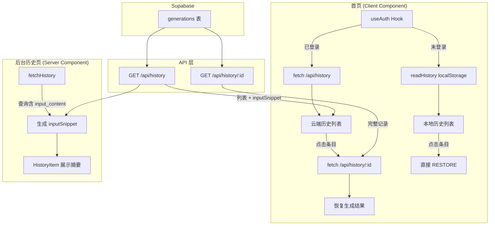

# 统一历史记录 — 设计文档

## 概述

本设计实现「方案 C」：同时改进后台历史页面和首页历史体验。

1. **后台侧**：`/dashboard/history` 和 History API 增加 `inputSnippet` 字段，`HistoryItem` 组件展示内容摘要。
2. **首页侧**：检测登录状态，登录用户从 History API 拉取云端历史替代 localStorage；未登录用户保持现有本地历史不变。
3. **类型层**：`HistorySummaryItem` 新增 `inputSnippet: string` 字段，后台和首页共用同一类型。

核心设计决策：
- 不新增数据库字段或表——`input_content` 已存在于 `generations` 表，摘要在查询层截取。
- 首页保持 `'use client'` 架构，通过 `useEffect` + `fetch` 获取云端历史。
- History API 新增 `GET /api/history/[id]` 路由，支持按 ID 查询单条完整记录（含 `result_json`），用于首页恢复生成结果。
- 登录状态检测使用已有的 `createSupabaseBrowserClient` + `onAuthStateChange`。

## 架构



### 数据流

1. **后台历史**：Server Component → 直接查询 Supabase → 截取 `input_content` 前 100 字符 → 传入 `HistoryItem`
2. **首页云端历史**：Client Component → `useAuth` 检测登录 → `fetch /api/history` → 渲染列表
3. **首页结果恢复**：点击云端条目 → `fetch /api/history/{id}` → 获取 `result_json` → dispatch `RESTORE`
4. **首页本地历史**：未登录 → `readHistory()` → 渲染列表（现有逻辑不变）

## 组件与接口

### 1. `useAuth` Hook（新增）

```typescript
// src/hooks/useAuth.ts
interface UseAuthReturn {
  user: AuthUser | null;
  loading: boolean;
}
function useAuth(): UseAuthReturn
```

- 使用 `createSupabaseBrowserClient` 获取初始 session
- 监听 `onAuthStateChange` 实时更新
- `loading` 为 `true` 时首页不渲染历史区域，避免闪烁

### 2. `useCloudHistory` Hook（新增）

```typescript
// src/hooks/useCloudHistory.ts
interface UseCloudHistoryReturn {
  items: HistorySummaryItem[];
  loading: boolean;
  error: string | null;
  refresh: () => void;
}
function useCloudHistory(enabled: boolean): UseCloudHistoryReturn
```

- `enabled` 为 `true` 时 fetch `/api/history?limit=10`
- 提供 `refresh()` 方法供生成完成后刷新
- 请求失败时 `error` 非空，调用方可回退到本地历史

### 3. History API 变更

#### GET `/api/history`（修改）

查询字段新增 `input_content`，响应中每条记录增加 `inputSnippet`：

```typescript
// select 新增 input_content
.select('id, input_source, input_content, platforms, platform_count, status, model_name, duration_ms, created_at')

// 映射时截取
inputSnippet: ((row.input_content as string) ?? '').slice(0, 100)
```

#### GET `/api/history/[id]`（新增）

```typescript
// src/app/api/history/[id]/route.ts
// 返回单条 generation 完整数据
interface HistoryDetailResponse {
  id: string;
  inputSource: 'manual' | 'extract';
  inputContent: string;
  platforms: string[];
  platformCount: number;
  resultJson: Record<string, unknown>;
  status: 'success' | 'partial' | 'failed';
  modelName: string | null;
  durationMs: number;
  createdAt: string;
}
```

- 需要认证（`getSession`）
- RLS 保证只能查询自己的记录
- 不存在时返回 404

### 4. `HistoryItem` 组件变更

新增 `inputSnippet` 展示：
- 有内容时显示截断文本（超 100 字符加 `…`）
- 空字符串时显示「无内容预览」占位文本
- 位置：在时间戳和状态标签行下方、平台标签行上方

### 5. Dashboard History 页面变更

`fetchHistory` 函数的 select 查询新增 `input_content` 字段，映射到 `inputSnippet`。

### 6. 首页 `page.tsx` 变更

- 引入 `useAuth` 和 `useCloudHistory`
- 根据登录状态切换历史数据源
- 云端历史条目点击时 fetch 详情再 RESTORE
- 生成成功后调用 `refresh()` 刷新云端历史
- API 失败时回退到本地历史
- 加载中显示 loading 指示器


## 数据模型

### 数据库层

不需要新增表或字段。现有 `generations` 表已包含所有必要数据：

| 字段 | 类型 | 用途 |
|------|------|------|
| `id` | uuid | 主键，用于详情查询 |
| `input_content` | text | 原始输入内容，截取前 100 字符生成摘要 |
| `result_json` | jsonb | 完整生成结果，用于首页恢复 |
| `platforms` | text[] | 平台列表 |
| `created_at` | timestamptz | 生成时间 |

### TypeScript 类型变更

```typescript
// src/types/index.ts — HistorySummaryItem 新增字段
export interface HistorySummaryItem {
  id: string;
  inputSource: 'manual' | 'extract';
  inputSnippet: string;        // ← 新增：input_content 前 100 字符
  platforms: string[];
  platformCount: number;
  status: 'success' | 'partial' | 'failed';
  modelName: string | null;
  durationMs: number;
  createdAt: string;
}
```

### 摘要截取逻辑

```typescript
function createSnippet(inputContent: string | null | undefined): string {
  const text = (inputContent ?? '').trim();
  if (text.length === 0) return '';
  return text.slice(0, 100);
}
```

- 截取在 API 层和 Server Component 查询层完成，不在客户端截取
- `HistoryItem` 组件负责展示逻辑：空字符串显示占位文本，超 100 字符显示省略号


## 正确性属性（Correctness Properties）

*属性（Property）是指在系统所有合法执行中都应成立的特征或行为——本质上是对系统应做什么的形式化陈述。属性是人类可读规格说明与机器可验证正确性保证之间的桥梁。*

### Property 1: 摘要截取正确性

*For any* 输入字符串 `s`，`createSnippet(s)` 的返回值应满足：
- 长度 ≤ 100
- 等于 `s.trim().slice(0, 100)`
- 当 `s` 仅含空白字符时返回空字符串

**Validates: Requirements 1.1, 4.3**

### Property 2: 摘要省略号展示

*For any* `HistorySummaryItem`，当 `inputSnippet` 长度等于 100 时，`HistoryItem` 组件渲染的摘要文本应以 `…` 结尾；当 `inputSnippet` 长度小于 100 且非空时，渲染文本不应包含 `…`。

**Validates: Requirements 1.4**

### Property 3: 历史条目完整渲染

*For any* `HistorySummaryItem`，渲染后的 `HistoryItem` 组件输出应同时包含：摘要文本（或空内容占位符）、所有平台标签、以及格式化的生成时间。

**Validates: Requirements 1.2, 3.3**

### Property 4: 详情接口返回完整记录

*For any* 属于当前用户的有效 generation ID，`GET /api/history/{id}` 应返回包含 `resultJson`、`platforms`、`inputContent`、`status` 等完整字段的记录，且 `resultJson` 与数据库中 `result_json` 一致。

**Validates: Requirements 6.2**

## 错误处理

| 场景 | 处理方式 |
|------|----------|
| History API 列表请求失败 | 首页回退到 localStorage 本地历史（需求 2.5） |
| History API 详情请求失败 | 首页显示错误提示 toast，不清空当前结果区域（需求 6.3） |
| `inputSnippet` 为空字符串 | `HistoryItem` 显示「无内容预览」占位文本（需求 1.5） |
| 用户未认证访问 `/api/history/[id]` | 返回 401 `UNAUTHORIZED` |
| generation ID 不存在或不属于当前用户 | 返回 404（RLS 自动过滤） |
| `onAuthStateChange` 触发登出 | 自动切换回本地历史，清空云端历史状态 |
| 网络超时 | `useCloudHistory` 设置 error 状态，触发回退逻辑 |

## 测试策略

### 属性测试（Property-Based Testing）

使用 **fast-check** 库进行属性测试，每个属性至少运行 100 次迭代。

每个测试用注释标注对应的设计属性：

```typescript
// Feature: unified-history, Property 1: 摘要截取正确性
// Feature: unified-history, Property 2: 摘要省略号展示
// Feature: unified-history, Property 3: 历史条目完整渲染
// Feature: unified-history, Property 4: 详情接口返回完整记录
```

| 属性 | 测试内容 | 生成器 |
|------|----------|--------|
| Property 1 | `createSnippet` 函数对任意字符串的截取正确性 | `fc.string()` 生成任意长度字符串 |
| Property 2 | `HistoryItem` 组件对不同长度摘要的省略号展示 | `fc.record()` 生成 `HistorySummaryItem`，`inputSnippet` 长度在 0-200 之间 |
| Property 3 | `HistoryItem` 组件渲染输出包含所有必要字段 | `fc.record()` 生成完整 `HistorySummaryItem` |
| Property 4 | 详情 API 返回与数据库一致的完整记录 | 集成测试，生成随机 generation 数据写入后查询 |

### 单元测试

单元测试聚焦具体示例和边界情况，避免与属性测试重复覆盖：

- `createSnippet` 边界：空字符串 → `''`、纯空白 → `''`、恰好 100 字符、101 字符
- `HistoryItem` 边界：`inputSnippet` 为空时显示「无内容预览」
- `useAuth` hook：初始 loading 状态、session 变化响应
- `useCloudHistory` hook：enabled=false 时不发请求、fetch 失败时 error 状态
- 首页集成：登录用户看到云端历史、未登录用户看到本地历史、API 失败回退到本地历史
- `/api/history/[id]`：未认证返回 401、ID 不存在返回 404

### 测试配置

- 属性测试库：`fast-check`（pnpm add -D fast-check）
- 组件测试：`@testing-library/react` + `vitest`
- 每个属性测试配置 `numRuns: 100`
- 每个属性测试必须由单个 property-based test 实现
