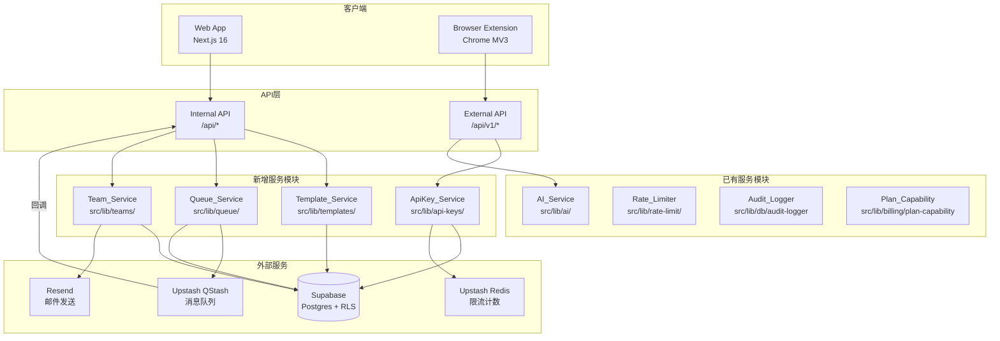

# 设计文档：v2-product-differentiation

## 1. 概述

### 目标

本阶段为 AutoContent Pro v2.0 产品差异化能力，在 v1.0 商业化基础上引入五项核心差异化功能：

- **自定义模板**：用户可创建、保存、复用生成参数配置
- **批量异步处理**：一次提交多条内容，通过 QStash 异步队列执行
- **团队协作**：支持团队创建、成员邀请、共享历史和模板
- **开放 API**：通过 API Key 对外暴露生成能力
- **浏览器插件 PoC**：Chrome Extension MV3，从目标页面一键生成文案

### 依赖前置阶段

| 阶段 | 提供的能力 |
|------|-----------|
| Phase 1 `autocontent-pro-mvp` | 核心生成流程、IP 限流、内容审核 |
| Phase 2 `supabase-infrastructure` | 数据库 schema、RLS、`audit_logs` |
| Phase 3 `cloud-data-plan-foundation` | 生成记录写入、使用统计、历史 API |
| Phase 4 `payments-monetization` | Lemon Squeezy、套餐能力校验 |
| Phase 5 `risk-control-launch-readiness` | 双维度限流、审计日志、内容审核增强 |

### 范围说明

严格对应 TASKS.md M3 任务（TSK-M3-001 至 TSK-M3-013），不扩展范围，不重新实现前置阶段已有功能。

---

## 2. 系统架构



---

## 3. 数据库设计

### 3.1 新增表结构

#### `user_templates`

```sql
CREATE TABLE public.user_templates (
  id                   UUID         PRIMARY KEY DEFAULT gen_random_uuid(),
  user_id              UUID         NOT NULL REFERENCES auth.users(id) ON DELETE CASCADE,
  name                 VARCHAR(100) NOT NULL CHECK (char_length(name) >= 1),
  tone                 VARCHAR(30)  NOT NULL CHECK (tone IN ('professional','casual','humorous','authoritative','empathetic')),
  length               VARCHAR(20)  NOT NULL DEFAULT 'medium' CHECK (length IN ('short','medium','long')),
  custom_instructions  TEXT         CHECK (char_length(custom_instructions) <= 2000),
  platform_overrides   JSONB        NOT NULL DEFAULT '{}'::jsonb,
  created_at           TIMESTAMPTZ  NOT NULL DEFAULT now(),
  updated_at           TIMESTAMPTZ  NOT NULL DEFAULT now()
);
CREATE INDEX idx_user_templates_user_id ON public.user_templates(user_id);
CREATE INDEX idx_user_templates_updated_at ON public.user_templates(updated_at DESC);
```

#### `batch_jobs`

```sql
CREATE TABLE public.batch_jobs (
  id              UUID        PRIMARY KEY DEFAULT gen_random_uuid(),
  user_id         UUID        NOT NULL REFERENCES auth.users(id) ON DELETE CASCADE,
  status          VARCHAR(20) NOT NULL DEFAULT 'pending'
                  CHECK (status IN ('pending','processing','completed','failed','partial')),
  item_count      INTEGER     NOT NULL CHECK (item_count BETWEEN 1 AND 50),
  completed_count INTEGER     NOT NULL DEFAULT 0 CHECK (completed_count >= 0),
  failed_count    INTEGER     NOT NULL DEFAULT 0 CHECK (failed_count >= 0),
  template_id     UUID        REFERENCES public.user_templates(id) ON DELETE SET NULL,
  platforms       TEXT[]      NOT NULL,
  created_at      TIMESTAMPTZ NOT NULL DEFAULT now(),
  updated_at      TIMESTAMPTZ NOT NULL DEFAULT now(),
  CONSTRAINT batch_jobs_counts_check CHECK (completed_count + failed_count <= item_count)
);
CREATE INDEX idx_batch_jobs_user_id ON public.batch_jobs(user_id);
CREATE INDEX idx_batch_jobs_status ON public.batch_jobs(status);
```

#### `batch_job_items`

```sql
CREATE TABLE public.batch_job_items (
  id            UUID        PRIMARY KEY DEFAULT gen_random_uuid(),
  job_id        UUID        NOT NULL REFERENCES public.batch_jobs(id) ON DELETE CASCADE,
  user_id       UUID        NOT NULL REFERENCES auth.users(id) ON DELETE CASCADE,
  status        VARCHAR(20) NOT NULL DEFAULT 'pending'
                CHECK (status IN ('pending','processing','completed','failed')),
  input_content TEXT        NOT NULL,
  results       JSONB,
  error_message TEXT,
  retry_count   INTEGER     NOT NULL DEFAULT 0 CHECK (retry_count BETWEEN 0 AND 3),
  created_at    TIMESTAMPTZ NOT NULL DEFAULT now(),
  updated_at    TIMESTAMPTZ NOT NULL DEFAULT now()
);
CREATE INDEX idx_batch_job_items_job_id ON public.batch_job_items(job_id);
CREATE INDEX idx_batch_job_items_status ON public.batch_job_items(status);
```

#### `teams`

```sql
CREATE TABLE public.teams (
  id         UUID         PRIMARY KEY DEFAULT gen_random_uuid(),
  name       VARCHAR(100) NOT NULL CHECK (char_length(name) >= 1),
  owner_id   UUID         NOT NULL REFERENCES auth.users(id) ON DELETE RESTRICT,
  plan_id    UUID         REFERENCES public.plans(id),
  created_at TIMESTAMPTZ  NOT NULL DEFAULT now(),
  updated_at TIMESTAMPTZ  NOT NULL DEFAULT now()
);
CREATE INDEX idx_teams_owner_id ON public.teams(owner_id);
```

#### `team_members`

```sql
CREATE TABLE public.team_members (
  id        UUID        PRIMARY KEY DEFAULT gen_random_uuid(),
  team_id   UUID        NOT NULL REFERENCES public.teams(id) ON DELETE CASCADE,
  user_id   UUID        NOT NULL REFERENCES auth.users(id) ON DELETE CASCADE,
  role      VARCHAR(20) NOT NULL CHECK (role IN ('owner','admin','member')),
  joined_at TIMESTAMPTZ NOT NULL DEFAULT now(),
  UNIQUE (team_id, user_id)
);
CREATE INDEX idx_team_members_team_id ON public.team_members(team_id);
CREATE INDEX idx_team_members_user_id ON public.team_members(user_id);
```

#### `team_invitations`

```sql
CREATE TABLE public.team_invitations (
  id             UUID        PRIMARY KEY DEFAULT gen_random_uuid(),
  team_id        UUID        NOT NULL REFERENCES public.teams(id) ON DELETE CASCADE,
  invited_email  VARCHAR(255) NOT NULL,
  invited_by     UUID        NOT NULL REFERENCES auth.users(id) ON DELETE CASCADE,
  token          VARCHAR(64) NOT NULL UNIQUE,
  role           VARCHAR(20) NOT NULL DEFAULT 'member' CHECK (role IN ('admin','member')),
  expires_at     TIMESTAMPTZ NOT NULL,
  accepted_at    TIMESTAMPTZ,
  created_at     TIMESTAMPTZ NOT NULL DEFAULT now()
);
CREATE INDEX idx_team_invitations_token ON public.team_invitations(token);
CREATE INDEX idx_team_invitations_team_id ON public.team_invitations(team_id);
```

#### `api_keys`

```sql
CREATE TABLE public.api_keys (
  id           UUID         PRIMARY KEY DEFAULT gen_random_uuid(),
  user_id      UUID         NOT NULL REFERENCES auth.users(id) ON DELETE CASCADE,
  name         VARCHAR(100) NOT NULL,
  key_hash     VARCHAR(64)  NOT NULL UNIQUE,
  key_prefix   VARCHAR(12)  NOT NULL,
  is_active    BOOLEAN      NOT NULL DEFAULT TRUE,
  last_used_at TIMESTAMPTZ,
  created_at   TIMESTAMPTZ  NOT NULL DEFAULT now()
);
CREATE INDEX idx_api_keys_user_id ON public.api_keys(user_id);
CREATE INDEX idx_api_keys_key_hash ON public.api_keys(key_hash);
```

### 3.2 RLS 策略设计

| 表 | 策略 | 说明 |
|----|------|------|
| `user_templates` | SELECT/INSERT/UPDATE/DELETE: `auth.uid() = user_id` | 用户只能操作自己的模板 |
| `batch_jobs` | SELECT/INSERT: `auth.uid() = user_id` | 用户只能查看自己的批量任务 |
| `batch_job_items` | SELECT: `auth.uid() = user_id` | 用户只能查看自己的任务项 |
| `teams` | SELECT: 用户是该团队成员 | 通过 `team_members` 子查询 |
| `team_members` | SELECT: `auth.uid() = user_id` 或用户是同团队成员 | 成员可见同团队其他成员 |
| `team_invitations` | SELECT: 用户是该团队 owner/admin | 仅管理员可查看邀请 |
| `api_keys` | SELECT/INSERT/DELETE: `auth.uid() = user_id` | 用户只能操作自己的 key |

`batch_job_items` 的 UPDATE 和 `batch_jobs` 的状态更新通过 service role 执行（QStash 回调使用 service role key）。

### 3.3 Migration SQL 文件

Migration 文件路径：`supabase/migrations/20260316000000_v2_schema.sql`

（完整 SQL 见第 3.4 节）

### 3.4 完整 Migration SQL

详见 `supabase/migrations/20260316000000_v2_schema.sql`，包含所有表创建、索引、触发器和 RLS 策略。

---

## 4. API 接口设计

所有接口遵循统一响应格式：
- 成功：`ApiSuccess<T>` — `{ success: true, data, requestId, timestamp }`
- 失败：`ApiError` — `{ success: false, error: { code, message, details? }, requestId, timestamp }`

### 4.1 模板管理接口

#### `POST /api/templates`

创建自定义模板。

- 认证：Supabase session cookie（必须）
- 请求体：

```typescript
{
  name: string;                  // 1-100 字符
  tone: 'professional' | 'casual' | 'humorous' | 'authoritative' | 'empathetic';
  length?: 'short' | 'medium' | 'long';  // 默认 'medium'
  custom_instructions?: string;  // 最长 2000 字符
  platform_overrides?: Record<string, unknown>;
}
```

- 响应：HTTP 201，`ApiSuccess<UserTemplate>`
- 错误码：`UNAUTHORIZED`(401)、`INVALID_INPUT`(400)

#### `GET /api/templates`

获取当前用户的模板列表，支持 `teamId` 查询参数获取团队共享模板。

- 认证：Supabase session cookie（必须）
- 查询参数：`teamId?: string`
- 响应：HTTP 200，`ApiSuccess<UserTemplate[]>`（按 `updated_at DESC` 排序）
- 错误码：`UNAUTHORIZED`(401)、`FORBIDDEN`(403)

#### `PUT /api/templates/:id`

更新指定模板。

- 认证：Supabase session cookie（必须）
- 请求体：同 POST，所有字段可选
- 响应：HTTP 200，`ApiSuccess<UserTemplate>`
- 错误码：`UNAUTHORIZED`(401)、`NOT_FOUND`(404)、`INVALID_INPUT`(400)

#### `DELETE /api/templates/:id`

删除指定模板。

- 认证：Supabase session cookie（必须）
- 响应：HTTP 200，`ApiSuccess<{ id: string }>`
- 错误码：`UNAUTHORIZED`(401)、`NOT_FOUND`(404)

### 4.2 生成接口扩展

#### `POST /api/generate`（扩展）

在现有接口基础上新增 `templateId` 参数支持。

- 新增请求字段：

```typescript
{
  templateId?: string;  // 可选，引用 user_templates.id
  // 其余字段不变
}
```

- 参数合并优先级：显式请求参数 > 模板参数 > 系统默认值
- 错误码新增：`NOT_FOUND`(404)（templateId 不存在或不属于当前用户）、`SERVICE_UNAVAILABLE`(503)（模板读取失败）

### 4.3 批量生成接口

#### `POST /api/generate/batch`

创建批量生成任务。

- 认证：Supabase session cookie（必须）
- 请求体：

```typescript
{
  items: Array<{
    content: string;   // 单条内容
    platforms: PlatformCode[];
  }>;                  // 1-50 条
  templateId?: string;
}
```

- 响应：HTTP 202，`ApiSuccess<{ jobId: string; itemCount: number; status: 'pending' }>`
- 错误码：`UNAUTHORIZED`(401)、`INVALID_INPUT`(400)、`PLAN_LIMIT_REACHED`(402)

### 4.4 任务状态查询

#### `GET /api/jobs/:id`

查询批量任务状态和结果。

- 认证：Supabase session cookie（必须）
- 响应：HTTP 200，`ApiSuccess<BatchJobStatus>`

```typescript
interface BatchJobStatus {
  jobId: string;
  status: 'pending' | 'processing' | 'completed' | 'failed' | 'partial';
  itemCount: number;
  completedCount: number;
  failedCount: number;
  createdAt: string;
  updatedAt: string;
  items?: Array<{          // 仅 completed 或 partial 时包含
    itemId: string;
    status: string;
    results: Record<string, unknown> | null;
  }>;
}
```

- 错误码：`UNAUTHORIZED`(401)、`NOT_FOUND`(404)

### 4.5 QStash 回调接口

#### `POST /api/jobs/callback`

QStash 异步回调，处理单条 `Batch_Job_Item`。

- 认证：QStash 签名验证（`QSTASH_CURRENT_SIGNING_KEY` + `QSTASH_NEXT_SIGNING_KEY`）
- 请求体：

```typescript
{
  jobId: string;
  itemId: string;
  retryCount: number;
}
```

- 响应：HTTP 200（成功）或 HTTP 500（失败，触发 QStash 重试）
- 此接口不对外暴露，仅供 QStash 调用

### 4.6 API Key 管理接口

#### `POST /api/keys`

创建 API Key。

- 认证：Supabase session cookie（必须）+ `has_api_access = true`
- 请求体：`{ name: string }`
- 响应：HTTP 201，`ApiSuccess<{ id: string; name: string; key: string; prefix: string; createdAt: string }>`
  - `key` 字段仅此一次返回明文，格式：`acp_` + 32 位随机字母数字
- 错误码：`UNAUTHORIZED`(401)、`PLAN_LIMIT_REACHED`(402)、`INVALID_INPUT`(400)

#### `GET /api/keys`

获取当前用户的 API Key 列表（不含明文）。

- 认证：Supabase session cookie（必须）
- 响应：HTTP 200，`ApiSuccess<ApiKeyItem[]>`

```typescript
interface ApiKeyItem {
  id: string;
  name: string;
  prefix: string;      // key 前 8 位（含 acp_ 前缀）
  createdAt: string;
  lastUsedAt: string | null;
}
```

- 错误码：`UNAUTHORIZED`(401)

#### `DELETE /api/keys/:id`

撤销 API Key，立即生效。

- 认证：Supabase session cookie（必须）
- 响应：HTTP 200，`ApiSuccess<{ id: string }>`
- 错误码：`UNAUTHORIZED`(401)、`NOT_FOUND`(404)

### 4.7 外部 API

#### `POST /api/v1/generate`

对外开放的生成接口，使用 API Key 认证。

- 认证：`Authorization: Bearer <api_key>` 请求头（不依赖 Supabase session）
- 限流：每个 API Key 每分钟最多 10 次（独立于内部接口限流）
- 请求体：与内部 `POST /api/generate` 相同
- 响应：与内部 `POST /api/generate` 相同
- 错误码：`UNAUTHORIZED`(401)、`RATE_LIMITED`(429)、`PLAN_LIMIT_REACHED`(402)

### 4.8 团队管理接口

#### `POST /api/teams`

创建团队。

- 认证：Supabase session cookie（必须）+ `has_team_access = true`
- 请求体：`{ name: string }`
- 响应：HTTP 201，`ApiSuccess<Team>`
- 错误码：`UNAUTHORIZED`(401)、`PLAN_LIMIT_REACHED`(402)、`INVALID_INPUT`(400)

#### `GET /api/teams`

获取当前用户所属的团队列表。

- 认证：Supabase session cookie（必须）
- 响应：HTTP 200，`ApiSuccess<Team[]>`
- 错误码：`UNAUTHORIZED`(401)

#### `POST /api/teams/:id/invitations`

发送团队邀请（仅 owner/admin 可操作）。

- 认证：Supabase session cookie（必须）
- 请求体：`{ email: string; role: 'admin' | 'member' }`
- 响应：HTTP 201，`ApiSuccess<{ invitationId: string; expiresAt: string }>`
- 错误码：`UNAUTHORIZED`(401)、`FORBIDDEN`(403)、`INVALID_INPUT`(400)

#### `POST /api/teams/:id/invitations/accept`

接受团队邀请。

- 认证：Supabase session cookie（必须）
- 请求体：`{ token: string }`
- 响应：HTTP 200，`ApiSuccess<TeamMember>`
- 错误码：`UNAUTHORIZED`(401)、`INVALID_INPUT`(400)（token 过期或已使用）

#### `DELETE /api/teams/:id/members/:userId`

移除团队成员（仅 owner 可操作）。

- 认证：Supabase session cookie（必须）
- 响应：HTTP 200，`ApiSuccess<{ userId: string }>`
- 错误码：`UNAUTHORIZED`(401)、`FORBIDDEN`(403)、`NOT_FOUND`(404)

---

## 5. 模块设计

### 5.1 `src/lib/templates/`

```typescript
// src/lib/templates/index.ts

export interface UserTemplate {
  id: string;
  userId: string;
  name: string;
  tone: 'professional' | 'casual' | 'humorous' | 'authoritative' | 'empathetic';
  length: 'short' | 'medium' | 'long';
  customInstructions?: string;
  platformOverrides: Record<string, unknown>;
  createdAt: string;
  updatedAt: string;
}

export interface CreateTemplateInput {
  name: string;
  tone: UserTemplate['tone'];
  length?: UserTemplate['length'];
  customInstructions?: string;
  platformOverrides?: Record<string, unknown>;
}

export interface TemplateService {
  create(userId: string, input: CreateTemplateInput): Promise<UserTemplate>;
  list(userId: string, teamId?: string): Promise<UserTemplate[]>;
  getById(id: string, userId: string): Promise<UserTemplate | null>;
  update(id: string, userId: string, input: Partial<CreateTemplateInput>): Promise<UserTemplate>;
  delete(id: string, userId: string): Promise<void>;
}
```

实现文件：`src/lib/templates/service.ts`，使用 Supabase service role client 执行数据库操作。

### 5.2 `src/lib/queue/`

```typescript
// src/lib/queue/index.ts

export interface BatchJobPayload {
  jobId: string;
  itemId: string;
  retryCount: number;
}

export interface QueueService {
  enqueueJob(jobId: string, payload: BatchJobPayload): Promise<void>;
}
```

实现细节：
- 使用 `QSTASH_TOKEN` 环境变量（仅服务端）
- 回调 URL：`${process.env.NEXT_PUBLIC_APP_URL}/api/jobs/callback`
- 失败时记录结构化日志，不抛出未捕获异常
- 每条 item 单独入队，支持 QStash 原生重试（最多 3 次）

### 5.3 `src/lib/api-keys/`

```typescript
// src/lib/api-keys/index.ts

export interface ApiKeyService {
  // 生成 acp_ + 32 位随机字母数字，返回明文（仅此一次）
  create(userId: string, name: string): Promise<{ id: string; key: string; prefix: string }>;
  // 列表不含明文 key
  list(userId: string): Promise<ApiKeyItem[]>;
  // 将 is_active 设为 false，立即生效
  revoke(id: string, userId: string): Promise<void>;
  // 验证 Bearer token，返回对应 userId 或 null
  verify(rawKey: string): Promise<string | null>;
  // 更新 last_used_at
  recordUsage(id: string): Promise<void>;
}
```

实现细节：
- Key 生成：`acp_` + `crypto.randomBytes(24).toString('base64url').slice(0, 32)`
- 存储：`SHA-256(rawKey)` 的 hex 字符串存入 `key_hash`
- 验证：对传入 key 计算 SHA-256，查询 `key_hash` 且 `is_active = true`
- 撤销后 Redis 缓存（如有）立即失效

### 5.4 `src/lib/teams/`

```typescript
// src/lib/teams/index.ts

export interface TeamService {
  create(ownerId: string, name: string): Promise<Team>;
  listForUser(userId: string): Promise<Team[]>;
  invite(teamId: string, invitedBy: string, email: string, role: 'admin' | 'member'): Promise<Invitation>;
  acceptInvitation(token: string, userId: string): Promise<TeamMember>;
  removeMember(teamId: string, requesterId: string, targetUserId: string): Promise<void>;
  getMemberRole(teamId: string, userId: string): Promise<TeamRole | null>;
}
```

实现细节：
- 邀请 token：`crypto.randomBytes(32).toString('hex')`（64 位十六进制）
- 邀请有效期：`NOW() + INTERVAL '7 days'`
- 邮件发送：通过 Resend SDK，模板包含邀请链接 `${APP_URL}/teams/accept?token=xxx`
- Owner 唯一性：移除成员前检查是否为最后一个 owner，是则拒绝

### 5.5 `browser-extension/` 目录结构

```
browser-extension/
  manifest.json          # Chrome MV3 manifest
  popup/
    popup.html           # 弹出面板 HTML
    popup.ts             # 弹出面板逻辑
    popup.css            # 样式
  content/
    content.ts           # Content script，负责页面内容提取
    extractors/
      wechat.ts          # 微信公众号文章提取器
      zhihu.ts           # 知乎文章提取器
  background/
    service-worker.ts    # MV3 Service Worker
  utils/
    api.ts               # External API 调用封装
    storage.ts           # chrome.storage.local 封装（API key 存储）
  tsconfig.json
  package.json
```

关键设计决策：
- Content script 注入目标页面，提取正文后通过 `chrome.runtime.sendMessage` 传递给 popup
- API key 存储在 `chrome.storage.local`，不上传服务器
- 调用 `POST /api/v1/generate`，使用 `Authorization: Bearer <api_key>` 头
- 内容少于 50 字符时禁用生成按钮，提示手动输入

---

## 6. 正确性属性

*属性（Property）是在系统所有合法执行路径上都应成立的特征或行为——本质上是对系统应做什么的形式化陈述。属性是人类可读规范与机器可验证正确性保证之间的桥梁。*

### Property 1：模板所有权隔离

*对于任意*两个不同用户 A 和 B，用户 A 创建的模板不得出现在用户 B 的 `GET /api/templates` 响应中；用户 B 对用户 A 的模板执行 `PUT` 或 `DELETE` 操作必须返回 HTTP 404。

**Validates: Requirements 1.3, 1.6**

### Property 2：模板参数覆盖优先级

*对于任意*包含 `templateId` 和显式 `options.tone` 的生成请求，实际使用的 `tone` 必须等于请求中的显式值；*对于任意*仅包含 `templateId` 的生成请求，实际使用的 `tone` 必须等于模板中存储的值。

**Validates: Requirements 2.1, 2.2**

### Property 3：批量任务 items 数量不变量

*对于任意* N 条内容（1 ≤ N ≤ 50）的有效批量请求，成功创建后 `batch_job_items` 中属于该 `jobId` 的记录数必须恰好等于 N，且响应中的 `itemCount` 也必须等于 N。

**Validates: Requirements 3.1, 3.3**

### Property 4：批量任务状态机合法性

*对于任意* `Batch_Job`，其最终状态必须由所有 items 的最终状态决定：全部 `completed` → `completed`；全部 `failed` → `failed`；混合 → `partial`。且在任意时刻，`completedCount + failedCount ≤ itemCount` 必须成立。

**Validates: Requirements 4.5**

### Property 5：API Key 唯一性与格式

*对于任意*两次 `POST /api/keys` 调用，返回的 key 字符串必须不同；*对于任意*生成的 key，必须满足正则 `^acp_[a-zA-Z0-9]{32}$`；`api_keys` 表中 `key_hash` 字段必须全局唯一。

**Validates: Requirements 8.1**

### Property 6：API Key 撤销即时生效

*对于任意*已通过 `DELETE /api/keys/:id` 撤销的 key，后续使用该 key 调用 `POST /api/v1/generate` 必须返回 HTTP 401，撤销与后续请求之间不得存在缓存窗口。

**Validates: Requirements 8.3, 8.6**

### Property 7：团队 Owner 唯一性

*对于任意*团队，`team_members` 表中 `role = 'owner'` 的记录数必须恰好为 1；任何导致 owner 数量变为 0 或超过 1 的操作必须被拒绝并返回错误。

**Validates: Requirements 6.5**

### Property 8：团队数据隔离

*对于任意*用户 A（属于团队 T1）和团队 T2（A 不属于），使用 `teamId=T2` 查询历史记录或模板时，必须返回 HTTP 403 或空结果，不得返回 T2 的数据。

**Validates: Requirements 6.4, 7.5, 7.6**

### Property 9：外部 API 限流一致性

*对于任意* API Key，在 1 分钟窗口内第 N 次请求（N ≤ 10）必须返回 HTTP 200；第 11 次及以后必须返回 HTTP 429；窗口重置后计数归零，下一次请求必须返回 HTTP 200。

**Validates: Requirements 8.7**

### Property 10：邀请 Token 不可重用

*对于任意* `accepted_at IS NOT NULL` 的邀请记录，再次使用其 token 必须返回 HTTP 400；*对于任意* `expires_at < NOW()` 的邀请记录，使用其 token 必须返回 HTTP 400。

**Validates: Requirements 7.3, 7.4**

---

## 7. 错误处理策略

### 7.1 新增错误码

在现有 `src/lib/errors/index.ts` 基础上新增：

| 错误码 | HTTP 状态 | 说明 |
|--------|-----------|------|
| `FORBIDDEN` | 403 | 无操作权限（如非 owner/admin 执行管理操作） |
| `INVITATION_EXPIRED` | 400 | 邀请 token 已过期（映射到 `INVALID_INPUT`） |
| `INVITATION_USED` | 400 | 邀请 token 已被使用（映射到 `INVALID_INPUT`） |
| `QUEUE_UNAVAILABLE` | 503 | QStash 服务不可用（映射到 `SERVICE_UNAVAILABLE`） |

> 注：`INVITATION_EXPIRED` 和 `INVITATION_USED` 在响应中统一使用 `INVALID_INPUT` 错误码，但内部日志记录具体原因。

### 7.2 降级策略

| 场景 | 降级行为 |
|------|---------|
| QStash 投递失败 | 返回 HTTP 202（不影响用户），记录结构化错误日志，任务状态保持 `pending`，可通过管理后台重新投递 |
| 模板读取失败（DB 超时） | 返回 HTTP 503 `SERVICE_UNAVAILABLE`，不影响无模板的生成请求 |
| Resend 邮件发送失败 | 邀请记录仍创建成功，返回 HTTP 201，但在响应 `data` 中附加 `emailSent: false` 标志，记录错误日志 |
| API Key 验证 Redis 不可用 | 降级到直接查询 Supabase `api_keys` 表，不缓存，记录警告日志 |

### 7.3 QStash 回调错误处理

- 回调接口返回 HTTP 5xx 时，QStash 自动重试（最多 3 次，指数退避）
- 重试次数通过 `batch_job_items.retry_count` 字段追踪
- 超过最大重试次数后，item 状态设为 `failed`，`error_message` 记录最后一次错误
- 所有 items 处理完毕后，触发 `batch_jobs` 状态聚合更新

---

## 8. 测试策略

### 8.1 测试框架

- 单元测试 / 属性测试：**Vitest** + **fast-check**（TypeScript 原生支持）
- 集成测试：Vitest + Supabase 本地实例（`supabase start`）
- E2E 测试：Playwright（已有，Phase 5 建立）

### 8.2 单元测试覆盖点

| 模块 | 测试重点 |
|------|---------|
| `src/lib/templates/service.ts` | CRUD 操作、所有权校验、Zod 校验 |
| `src/lib/api-keys/index.ts` | Key 生成格式、SHA-256 哈希、撤销逻辑 |
| `src/lib/queue/index.ts` | enqueueJob 调用、失败时不抛出异常 |
| `src/lib/teams/index.ts` | 邀请创建、token 过期校验、owner 唯一性 |
| `browser-extension/content/extractors/` | 微信/知乎页面内容提取函数 |

### 8.3 集成测试覆盖点

| 接口 | 测试场景 |
|------|---------|
| `POST /api/templates` | 创建成功、无效 tone、超长 name、未认证 |
| `POST /api/generate/batch` | 有效批量、超出 50 条、无权限套餐 |
| `GET /api/jobs/:id` | 任务存在、任务不属于当前用户 |
| `POST /api/keys` | 创建成功（验证 key 格式）、无 API 权限 |
| `POST /api/v1/generate` | 有效 key、已撤销 key、超限 |
| `POST /api/teams/:id/invitations` | 有效邀请、非 admin 操作 |

### 8.4 属性测试（PBT）配置

使用 **fast-check** 库，每个属性测试最少运行 **100 次**迭代。

每个属性测试必须包含注释标签：
```
// Feature: v2-product-differentiation, Property N: <property_text>
```

#### 属性测试列表

**Property 1：模板所有权隔离**
```typescript
// Feature: v2-product-differentiation, Property 1: 模板所有权隔离
// For any two users A and B, A's templates must not appear in B's list
fc.assert(fc.asyncProperty(
  fc.record({ name: fc.string({ minLength: 1, maxLength: 100 }), tone: fc.constantFrom(...TONES) }),
  async (templateInput) => {
    // 用户 A 创建模板，验证用户 B 的列表中不包含该模板
  }
), { numRuns: 100 });
```

**Property 2：模板参数覆盖优先级**
```typescript
// Feature: v2-product-differentiation, Property 2: 模板参数覆盖优先级
// For any templateId + explicit tone, explicit tone wins
fc.assert(fc.asyncProperty(
  fc.constantFrom(...TONES), fc.constantFrom(...TONES),
  async (templateTone, explicitTone) => {
    // 创建 tone=templateTone 的模板，请求中传 tone=explicitTone，验证实际使用 explicitTone
  }
), { numRuns: 100 });
```

**Property 3：批量任务 items 数量不变量**
```typescript
// Feature: v2-product-differentiation, Property 3: 批量任务 items 数量不变量
// For any N items (1-50), created job must have exactly N items in DB
fc.assert(fc.asyncProperty(
  fc.integer({ min: 1, max: 50 }),
  async (n) => {
    // 生成 n 条内容，创建批量任务，验证 DB 中 items 数量 === n
  }
), { numRuns: 100 });
```

**Property 4：批量任务状态机合法性**
```typescript
// Feature: v2-product-differentiation, Property 4: 批量任务状态机合法性
// For any combination of item outcomes, job final status follows the aggregation rule
fc.assert(fc.asyncProperty(
  fc.array(fc.constantFrom('completed', 'failed'), { minLength: 1, maxLength: 50 }),
  async (itemStatuses) => {
    // 模拟 items 最终状态，验证 job 状态聚合规则
  }
), { numRuns: 100 });
```

**Property 5：API Key 唯一性与格式**
```typescript
// Feature: v2-product-differentiation, Property 5: API Key 唯一性与格式
// For any two key generation calls, keys must be different and match format
fc.assert(fc.asyncProperty(
  fc.integer({ min: 2, max: 10 }),
  async (count) => {
    // 生成 count 个 key，验证全部唯一且格式匹配 /^acp_[a-zA-Z0-9]{32}$/
  }
), { numRuns: 100 });
```

**Property 6：API Key 撤销即时生效**
```typescript
// Feature: v2-product-differentiation, Property 6: API Key 撤销即时生效
// For any revoked key, subsequent use must return 401
fc.assert(fc.asyncProperty(
  fc.constant(null),
  async () => {
    // 创建 key，撤销，立即使用，验证返回 401
  }
), { numRuns: 100 });
```

**Property 7：团队 Owner 唯一性**
```typescript
// Feature: v2-product-differentiation, Property 7: 团队 Owner 唯一性
// For any team, owner count must always be exactly 1
fc.assert(fc.asyncProperty(
  fc.array(fc.record({ role: fc.constantFrom('admin', 'member') }), { minLength: 0, maxLength: 5 }),
  async (members) => {
    // 创建团队，添加若干成员，验证 owner 数量始终为 1
  }
), { numRuns: 100 });
```

**Property 8：团队数据隔离**
```typescript
// Feature: v2-product-differentiation, Property 8: 团队数据隔离
// For any user not in team T, querying T's data must return 403 or empty
fc.assert(fc.asyncProperty(
  fc.constant(null),
  async () => {
    // 创建两个团队，验证跨团队查询被拒绝
  }
), { numRuns: 100 });
```

**Property 9：外部 API 限流一致性**
```typescript
// Feature: v2-product-differentiation, Property 9: 外部 API 限流一致性
// For any API key, requests 1-10 succeed, request 11+ returns 429
fc.assert(fc.asyncProperty(
  fc.integer({ min: 1, max: 10 }),
  async (n) => {
    // 发送 n 次请求（n <= 10），验证全部返回 200；发送第 11 次，验证返回 429
  }
), { numRuns: 100 });
```

**Property 10：邀请 Token 不可重用**
```typescript
// Feature: v2-product-differentiation, Property 10: 邀请 Token 不可重用
// For any accepted or expired invitation token, reuse must return 400
fc.assert(fc.asyncProperty(
  fc.constantFrom('accepted', 'expired'),
  async (scenario) => {
    // 创建邀请，模拟已接受或已过期，再次使用 token，验证返回 400
  }
), { numRuns: 100 });
```

### 8.5 测试文件结构

```
tests/
  unit/
    templates/
      service.test.ts
    api-keys/
      service.test.ts
    queue/
      service.test.ts
    teams/
      service.test.ts
    browser-extension/
      extractors.test.ts
  integration/
    templates.test.ts
    batch.test.ts
    api-keys.test.ts
    teams.test.ts
    external-api.test.ts
  property/
    v2-product-differentiation.property.test.ts
```
